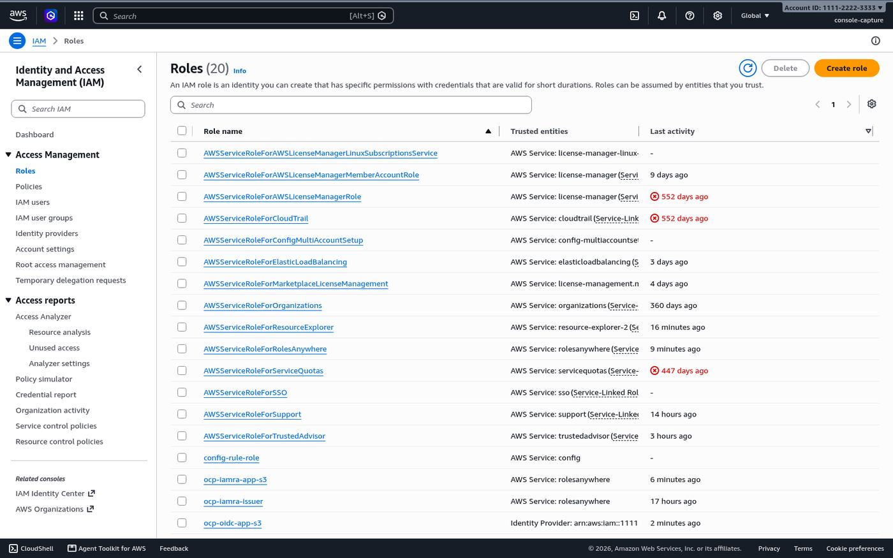
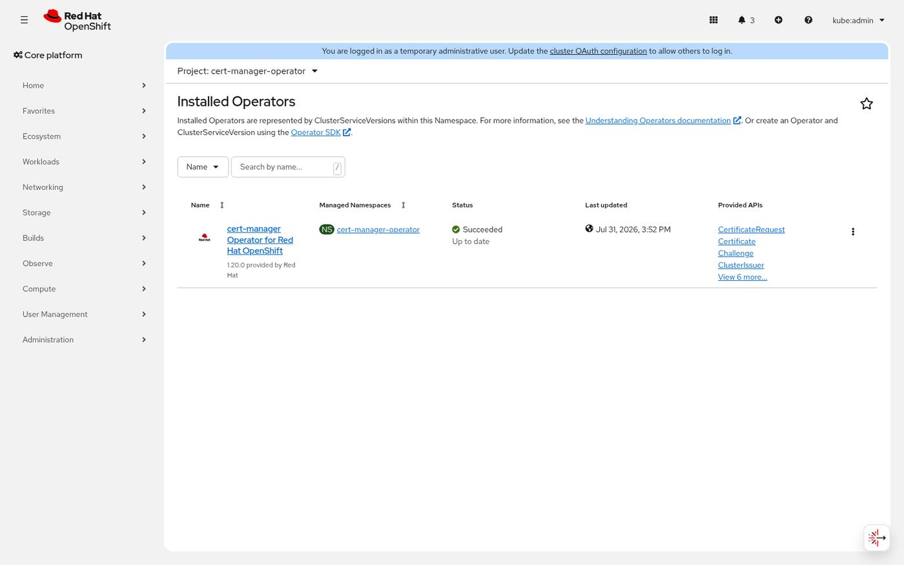
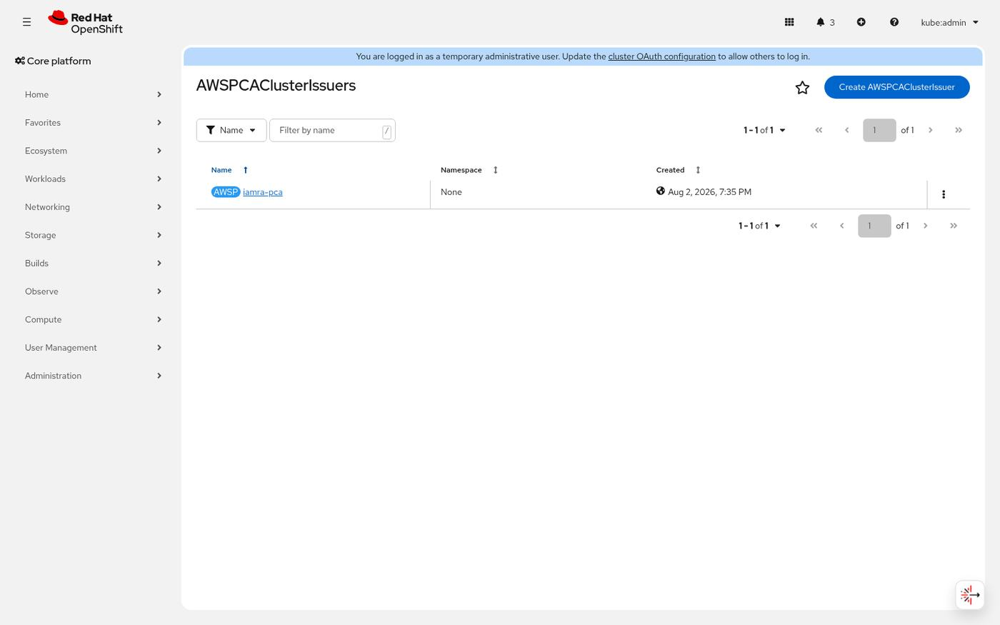

# On-prem OpenShift → AWS APIs, with no long-lived credentials

**Three** ways to give on-prem OpenShift workloads AWS API access without an
access key, implemented side by side so you can compare them on one cluster. All
driven by Ansible in a Podman container — no local Ansible install, nothing to
install but Podman.

The demo application is **byte-identical** across all three. That is the point:
[`app/app.py`](app/app.py) is ordinary boto3 with no credential handling at all,
and switching mechanisms changes one environment variable.

| | [`iamra`](#iamra) | [`oidc`](#oidc) | [`vault`](#vault) |
|---|---|---|---|
| **Full guide** | **[→ IAM Roles Anywhere](#iamra)** | **[→ OIDC federation](#oidc)** | **[→ HashiCorp Vault](#vault)** |
| What proves identity | short-lived X.509 certificate | projected ServiceAccount token | ServiceAccount token, to Vault |
| Who verifies it | AWS | AWS | Vault |
| Sidecar in the pod | yes | **no** | yes (injected) |
| Recurring AWS cost | **~$400/mo** (Private CA) | none | none |
| Outbound reachability | `rolesanywhere` + `acm-pca` | `sts` | `sts` (from Vault only) |
| Inbound reachability | none | **JWKS document AWS can fetch** | none |
| Long-lived secret anywhere | **none** | **none** | Vault's AWS key |
| Cluster reconfiguration | none | **kube-apiserver rollout** | none |
| PSA relaxation needed | **`privileged`** | none | none |
| Blast radius of a failure | one workload | **whole cluster** | Vault outage |
| Works for non-Kubernetes hosts | **yes** | no | yes |
| One-command deploy | `./ansible-runner.sh iamra` | `./ansible-runner.sh oidc` | `./ansible-runner.sh vault` |

Each method is **completely independent** — its own namespace, its own IAM role,
its own infrastructure. Running one neither creates nor requires anything
belonging to the other two. Run all three and you get three live comparisons on
one cluster.

Started from
[Connect your on-premises Kubernetes cluster to AWS APIs using IAM Roles Anywhere](https://aws.amazon.com/blogs/security/connect-your-on-premises-kubernetes-cluster-to-aws-apis-using-iam-roles-anywhere/),
with the gaps in that article closed and the OpenShift-specific parts handled —
then extended with the two alternatives.

All three, coexisting on one cluster:




📄 **[docs/environment-capture.md](docs/environment-capture.md)** — a capture of
all three running side by side, with screenshots and real terminal output.
✍️ **[blog/three-ways-into-aws.md](blog/three-ways-into-aws.md)** — the long-form
write-up: the trade-offs, and the failures that cost the most time.

Screenshots throughout are from a live deployment. Redaction runs **in the page
before the shot is taken**, so they are faithful renders of redacted pages rather
than edited images — the AWS account id reads `111122223333` and every key id,
token and resource UUID is a fixed placeholder.

---

## Contents

- [Before you start](#before-you-start) — shared prerequisites
- [`iamra` — IAM Roles Anywhere](#iamra)
- [`oidc` — OIDC federation](#oidc)
- [`vault` — HashiCorp Vault AWS secrets engine](#vault)
- [Choosing between them](#choosing-between-them)
- [RBAC and permission scoping](#rbac-and-permission-scoping)
- [The demo application](#the-demo-application)
- [Inspecting a running pod](#inspecting-a-running-pod)
- [Findings from actually running this](#findings-from-actually-running-this)
- [Layout](#layout)

---

<a id="before-you-start"></a>

## Before you start

Shared by all three methods.

| | |
|---|---|
| Local | `podman`. That is all — Ansible, `oc`, `helm` and the AWS CLI live in the runner image |
| OpenShift | 4.16+ — native sidecars (`initContainers` with `restartPolicy: Always`) |
| OpenShift | the internal image registry enabled, for the default in-cluster builds |
| AWS | permissions for `iam`, `s3`, plus `acm-pca` + `rolesanywhere` for the `iamra` path |

Verified against OpenShift 4.22, `aws_signing_helper` 1.7.0,
`aws-privateca-issuer` v1.9.1, `cert-manager-csi-driver` v0.15.0,
Vault chart 0.34.0.

```bash
export KUBECONFIG=/path/to/kubeconfig      # or copy it to ./kubeconfig
# AWS credentials are read from ~/.aws (or $AWS_SHARED_CREDENTIALS_FILE)

./ansible-runner.sh build                  # build the Ansible runner image, once
```

Then pick a method below.

### Network

**Every method needs outbound reachability to AWS.** None of them work in an
environment with no path to AWS at all — the pod (or Vault) has to reach an AWS
endpoint to obtain credentials in the first place.

| Method | Who connects out | To what | How often |
|---|---|---|---|
| `iamra` | every pod's sidecar | `rolesanywhere.<region>.amazonaws.com` | on every `CreateSession`, i.e. at startup and each credential refresh |
| `iamra` | the `aws-privateca-issuer` pod | `acm-pca.<region>.amazonaws.com` | whenever a certificate is issued or renewed |
| `oidc` | every pod (via the AWS SDK) | `sts.<region>.amazonaws.com` | on `AssumeRoleWithWebIdentity` and each refresh |
| `vault` | the Vault server only | `sts.<region>.amazonaws.com` | when a lease is created or renewed |

All of that is **outbound**, and all of it can go over PrivateLink / VPC
endpoints reached via Direct Connect or a VPN — none of it requires the public
internet. (The AWS blog post says this pattern needs public internet access; it
does not.) Note the `vault` row: application pods never talk to AWS at all, only
Vault does, which is the smallest egress footprint of the three.

**Only `oidc` additionally needs inbound reachability** — AWS STS must fetch your
OIDC discovery document and JWKS before it can verify a token.

### Configuration

Everything lives in
[`inventory/group_vars/all.yml`](inventory/group_vars/all.yml) and is overridable
per run with `-e key=value`. The ones you are most likely to change:

```yaml
aws_region: "us-east-2"
demo_bucket: ""            # "" derives one from the account id
app_service_account: "s3-demo"
app_namespace: "{{ auth_method }}-demo"
```

---

<a id="iamra"></a>

## `iamra` — IAM Roles Anywhere

A short-lived X.509 certificate, issued by cert-manager from an AWS Private CA,
is exchanged for STS credentials by a sidecar that serves an IMDSv2 endpoint on
loopback. The application believes it is running on EC2.

```
AWS Private CA  (SHORT_LIVED_CERTIFICATE mode, ≤7 days)
        │
        ├── IAM Roles Anywhere trust anchor
        │        ├── role ocp-iamra-issuer     trust policy pins CN=iamra-issuer
        │        └── role ocp-iamra-app-s3     trust policy pins CN=s3-demo.iamra-demo
        │
   cert-manager  (Red Hat cert-manager Operator)
        ├── aws-privateca-issuer + credential sidecar   ← bootstrap identity
        └── csi.cert-manager.io                          ← per-pod ephemeral certs
                 │
            demo app pod
              ├── iamra-sidecar (native sidecar)  serves IMDSv2 on 127.0.0.1:9911
              └── app  AWS_EC2_METADATA_SERVICE_ENDPOINT=http://127.0.0.1:9911/
```

### Read this first

**The Private CA costs roughly $400/month**, from creation until deletion.
Disabling it does not stop the charge, and deletion enforces a 7–30 day
restoration window during which you are still billed. This is the single largest
practical consideration in the design and the blog post does not mention it.
See [Using your own CA instead](#iamra-own-ca) to avoid it entirely.

**Short-lived certificate mode has no revocation.** AWS Private CA in
`SHORT_LIVED_CERTIFICATE` mode publishes no CRL and supports no OCSP. Your
revocation story is expiry — 6 days for the certificates issued here, or
immediately if you disable the Roles Anywhere profile or trust anchor. Set
`pca_usage_mode: GENERAL_PURPOSE` if you need real revocation, and expect to pay
more per certificate.

### Steps

Everything at once:

```bash
./ansible-runner.sh iamra
```

…or step by step, which is the same thing and lets you inspect between stages:

| # | Command | What it creates |
|---|---|---|
| 1 | `./ansible-runner.sh images` | app + sidecar images, built in-cluster |
| 2 | `./ansible-runner.sh aws` | Private CA, trust anchor, 2 IAM roles, 2 Roles Anywhere profiles, S3 bucket |
| 3 | `./ansible-runner.sh certmanager` | Red Hat cert-manager Operator + the CSI driver |
| 4 | `./ansible-runner.sh issuer` | bootstrap certificate → `aws-privateca-issuer` → `AWSPCAClusterIssuer` |
| 5 | `./ansible-runner.sh app -e auth_method=iamra` | namespace, RBAC, Deployment, Service, Route |
| 6 | `./ansible-runner.sh validate -e auth_method=iamra` | proves it end to end from inside the pod |

Steps 2–4 together are `./ansible-runner.sh iamra-setup`.

```bash
# a complete iamra deployment, spelled out
./ansible-runner.sh build
./ansible-runner.sh images
./ansible-runner.sh aws -e demo_bucket=my-unique-bucket
./ansible-runner.sh certmanager
./ansible-runner.sh issuer
./ansible-runner.sh app      -e auth_method=iamra
./ansible-runner.sh validate -e auth_method=iamra
```

### What it creates

| Where | What |
|---|---|
| AWS | Private CA (`SHORT_LIVED_CERTIFICATE`), Roles Anywhere trust anchor `ocp-onprem-k8s` |
| AWS | roles `ocp-iamra-issuer` and `ocp-iamra-app-s3`, one Roles Anywhere profile each |
| AWS | S3 bucket for the demo app |
| Cluster | `cert-manager-operator` + `cert-manager` namespaces, CSI driver DaemonSet |
| Cluster | `aws-privateca-issuer` Deployment with the credential sidecar |
| Cluster | `AWSPCAClusterIssuer/iamra-pca`, `Certificate/iamra-issuer` |
| Cluster | namespace `iamra-demo` with the demo app |

The Private CA and the trust anchor, in the AWS console:


The cert-manager operator and the ClusterIssuer it backs, in the OpenShift
console:





And the result — two containers per pod, app plus credential sidecar:


### How the bootstrap works

`aws-privateca-issuer` needs AWS credentials to mint certificates, and it gets
those credentials by presenting a certificate. Step 4 breaks the loop:

```
aws acm-pca issue-certificate  (CN=iamra-issuer, 7 days, by hand)
   └─► Secret cert-manager/iamra-issuer
        └─► the issuer's own sidecar authenticates with it
             └─► AWSPCAClusterIssuer goes Ready
                  └─► a cert-manager Certificate takes over that same Secret
                       └─► from then on the issuer renews its own credential
```

The bootstrap step is conditional on that Secret's absence, so it runs once and
never again — unless you delete the Secret.

### Certificate rotation

Nothing in the article addresses this. `aws_signing_helper serve` loads the
certificate and key once at startup, so when cert-manager renews them underneath
the process it keeps presenting the old ones — and roughly a week after a
successful deployment, every AWS call starts failing.

[`sidecar/healthcheck.sh`](sidecar/healthcheck.sh) is the liveness probe and
fails once the mounted certificate is inside `RELOAD_BEFORE` of expiry. kubelet
restarts that container, it re-reads the renewed files, and because it is a
native sidecar the application container is never disturbed. `RELOAD_BEFORE` is
set shorter than the certificate's `renewBefore` so the replacement is already on
disk when it fires.

Durations are `144h` (6 days), not the `168h` the article uses: 168h sits exactly
on the Private CA short-lived cap with no margin for clock skew.

### The failure mode you will actually hit

When the certificate exchange fails, `aws_signing_helper serve` does **not**
report an error to the SDK. It answers with HTTP 200 and an empty credential
document:

```json
{"AccessKeyId":"","SecretAccessKey":"","Token":"","Code":"Success",
 "Expiration":"0001-01-01T00:00:00Z"}
```

botocore then tries to parse that zero date and raises
`OverflowError: date value out of range`. Nothing in the traceback mentions AWS,
credentials, or certificates — so an application catching the obvious
`ClientError` / `NoCredentialsError` turns the most common failure of this
architecture into an unhandled 500. [`app/app.py`](app/app.py) catches it and
says where to look.

### Things that bite

**Roles Anywhere profiles reject a client-supplied session name by default.** The
sidecar sets one — the pod name, so CloudTrail can attribute an AWS call to an
individual pod (`assumed-role/ocp-iamra-app-s3/s3-demo-5c457f7ffc-57hc9`). Without
`--accept-role-session-name` on the profile, every `CreateSession` returns
`AccessDeniedException: Not authorized to set roleSessionName`. The article never
sets a session name, so it never hits this — and loses per-pod attribution.

**Probes on the sidecar must be `exec`.** `aws_signing_helper serve` binds
`127.0.0.1` only, which is correct — nothing outside the pod should be able to
ask it for AWS credentials. kubelet dials the *pod IP*, so a `tcpSocket` or
`httpGet` probe is refused every time and the sidecar restart-loops while its log
cheerfully reports that it is serving.

**Inline CSI volumes require `pod-security.kubernetes.io/enforce: privileged`.**
This is the real price of pod-lifecycle-bound certificates. It does not make the
pods privileged — SCC still governs and every container here is restricted-v2
compliant — but it does remove the PSA net for anything else in that namespace.
OpenShift's label-sync controller will also revert the label unless the namespace
carries `security.openshift.io/scc.podSecurityLabelSync: "false"`.
See [avoiding it](#iamra-no-psa) below.

**`csi.cert-manager.io/pkcs12-enable` must be absent, not `"false"`.** The driver
validates it with `if enable := attr[KeyStorePKCS12EnableKey]; len(enable) > 0`,
so *any* value — including the string `"false"` — takes the enabled branch and
the mount then fails demanding a `pkcs12-password`. Omitting the key is the only
way to turn it off.

**The bootstrap certificate must outlive the sidecar's reload window.** A one-day
bootstrap certificate deadlocks against a 24h `RELOAD_BEFORE`: it is "about to
expire" from birth, the sidecar never becomes healthy, the issuer never becomes
Ready, and cert-manager therefore never gets to issue the long-lived replacement.
It is issued for 7 days, and the expiry check is excluded from the *startup*
probe for the same reason.

**OpenShift specifics.** The chart's hard-coded `runAsUser: 65532` is removed;
under `restricted-v2` OpenShift allocates a UID from the namespace range and a
pod pinning one outside it is rejected. The issuer's Secret is mounted `0440`,
not `0400`, so the arbitrary UID can read the key through its GID-0 primary
group. The CSI driver genuinely needs the `privileged` SCC — hostPath mounts
under `/var/lib/kubelet` with bidirectional propagation.

### Who can get a certificate

The trust anchor accepts any certificate chaining to the CA, so the real question
is who can obtain one bearing a privileged CN.

The control here is RBAC. With `useTokenRequest: true`, every
`CertificateRequest` is created as the mounting pod's ServiceAccount, so the
`Role`/`RoleBinding` in
[rbac.yaml.j2](roles/demo_app/templates/rbac.yaml.j2) decides which workloads can
get a certificate at all.

That bounds *who*, not *what CN they ask for*. Full content validation needs
cert-manager `approver-policy`, which requires disabling cert-manager's built-in
approver cluster-wide — that breaks unrelated certificates (Let's Encrypt ingress
certs, for instance) unless a catch-all policy is applied first, and the Red Hat
operator may not accept the required `--controllers` argument at all. The article
makes that change without comment. It is deliberately not automated here — see
[docs/approver-policy.md](docs/approver-policy.md) for the manifests and the
install order, and check first with:

```bash
oc explain certmanager.spec.controllerConfig.overrideArgs
```

Note also that AWS Private CA has **no condition key for the requested subject**.
`acm-pca:TemplateArn` constrains the template, but nothing constrains the CN in
the CSR — so anyone holding the issuer role can mint a certificate with any CN.
Compromise of the issuer role is equivalent to compromise of every workload
identity under that trust anchor. The template pin prevents escalation to a
signing CA; it does not prevent impersonation of a peer. A separate CA and trust
anchor per trust domain is the lever if you need a harder boundary.

<a id="iamra-own-ca"></a>

### Using your own CA instead of Private CA

To avoid the ~$400/month, back the trust anchor with a CA bundle you manage:

```bash
aws rolesanywhere create-trust-anchor --name onprem-selfmanaged --enabled \
  --source 'sourceType=CERTIFICATE_BUNDLE,sourceData={x509CertificateData="'"$(cat root-ca.pem)"'"}'
```

Then replace `AWSPCAClusterIssuer` with a cert-manager `ClusterIssuer` of kind
`CA` over that root and point `csi.cert-manager.io/issuer-*` at it. Everything
from the sidecar onwards — the trust policies, the CN pinning, the rotation
handling, the app — is unchanged, and the whole bootstrap problem disappears
along with `aws-privateca-issuer`. You take on running the CA, including
protecting its key.

<a id="iamra-no-psa"></a>

### Avoiding the privileged PSA label

If relaxing Pod Security Admission on the workload namespace is not acceptable,
drop the CSI driver and issue an ordinary `Certificate` into a `Secret`:

```yaml
# instead of the csi: volume
- name: iamra-cert
  secret:
    secretName: s3-demo-tls
    defaultMode: 0440
```

with a `Certificate` whose `commonName` is `s3-demo.iamra-demo` and a matching
`secretName`. PSA stays `restricted` and no inline volume is involved.

What you give up: the certificate is no longer bound to the pod lifecycle. It
lives in a Secret that outlives the pod, anything able to read Secrets in that
namespace can assume the AWS role, and you are back to protecting a stored
credential — which is most of what this architecture exists to avoid. The
`useTokenRequest` RBAC boundary also disappears, since cert-manager creates the
request rather than the workload.

### Pinning the URI SAN

The CSI driver can set URI SANs and supports the same pod variables there, so a
SPIFFE-style identity is available as a second condition:

```yaml
csi.cert-manager.io/uri-sans: "spiffe://cluster.local/ns/${POD_NAMESPACE}/sa/${SERVICE_ACCOUNT_NAME}"
```

IAM Roles Anywhere surfaces SANs as session tags such as
`aws:PrincipalTag/x509SAN/URI`. Before adding a condition on it, issue one
certificate and confirm the tag actually appears on the `CreateSession` event in
CloudTrail — a condition on a tag that is not set denies every request.

### Recovering from a fully expired issuer

If the cluster is down long enough for the issuer's own certificate to expire, it
cannot renew itself — it needs a valid certificate to obtain the credentials it
would use to issue one. Delete the Secret and re-run; the bootstrap path fires
again automatically:

```bash
oc -n cert-manager delete secret iamra-issuer
./ansible-runner.sh issuer
```

### Teardown

```bash
./ansible-runner.sh destroy --destroy -e auth_method=iamra                     # cluster only
./ansible-runner.sh destroy --destroy -e auth_method=iamra -e destroy_aws=true # + AWS, stops the CA bill
```

Deleting the CA is what stops the charge. AWS still bills through the 7-day
restoration window, which is the minimum it allows.

---

<a id="oidc"></a>

## `oidc` — OIDC federation (self-managed IRSA)

Your cluster already mints signed identity tokens for every pod. This teaches AWS
to trust that signer, so a pod hands its own ServiceAccount token to STS and gets
credentials back. **No CA, no certificate, no sidecar, nothing to bootstrap.**

```
cluster JWKS ──publish──► S3 (anonymously readable)
                             │
                    IAM OIDC identity provider
                             │
          role trusts  sub = system:serviceaccount:oidc-demo:s3-demo
                       aud = sts.amazonaws.com
                             │
                  projected SA token (aud: sts.amazonaws.com, 1h)
                             │
              AWS SDK ──► sts:AssumeRoleWithWebIdentity ──► credentials
```

### Read this first

**This is the only method that reconfigures the cluster.** Setting
`spec.serviceAccountIssuer` rolls **every kube-apiserver** (10–40 minutes) and
re-issues ServiceAccount tokens cluster-wide. That step is gated behind
`oidc_set_service_account_issuer` so you can run everything else first and
inspect it.

**A stale JWKS breaks every workload at once.** When the cluster rotates its
ServiceAccount signing keys, the published `keys.json` no longer contains the key
that signed live tokens. Re-running the setup republishes it — treat that as a
scheduled job, not something you remember to do. This is the structural downside
versus `iamra`, where a bad certificate takes out one pod.

**AWS must be able to fetch your discovery document.** It contains public keys
and metadata only, so publishing it discloses nothing — but it has to be
reachable. Account-level Block Public Access will stop this.

### Steps

Everything at once (still stops short of the disruptive step):

```bash
./ansible-runner.sh oidc
```

…or step by step:

| # | Command | What it creates |
|---|---|---|
| 1 | `./ansible-runner.sh images` | the app image, built in-cluster (no sidecar needed) |
| 2 | `./ansible-runner.sh oidc-setup` | S3 bucket, published JWKS + discovery doc, IAM OIDC provider, web-identity role |
| 3 | `./ansible-runner.sh oidc-setup -e oidc_set_service_account_issuer=true` | **reconfigures the cluster** — rolls every kube-apiserver |
| 4 | `./ansible-runner.sh app -e auth_method=oidc` | namespace, ServiceAccount, Deployment, Service, Route |
| 5 | `./ansible-runner.sh validate -e auth_method=oidc` | decodes the token claims and proves federation works |

Step 2 is safe to run and inspect at any time; it reports exactly what is still
missing rather than silently half-working. Step 4 **refuses to deploy** until the
cluster's issuer matches the registered provider, so you cannot end up with pods
that fail opaquely later.

```bash
# a complete oidc deployment, spelled out
./ansible-runner.sh build
./ansible-runner.sh images
./ansible-runner.sh oidc-setup
./ansible-runner.sh oidc-setup -e oidc_set_service_account_issuer=true   # 10-40 min
./ansible-runner.sh app      -e auth_method=oidc
./ansible-runner.sh validate -e auth_method=oidc
```

### What it creates

| Where | What |
|---|---|
| AWS | S3 bucket `cluster-oidc-<account>-<region>`, public read on **two objects only** |
| AWS | IAM OIDC identity provider for that bucket's URL |
| AWS | role `ocp-oidc-app-s3`, trust policy pinning `sub` and `aud` |
| AWS | S3 bucket for the demo app |
| Cluster | `spec.serviceAccountIssuer` on `authentication.config/cluster` |
| Cluster | namespace `oidc-demo` with the demo app — **one container** |

The identity provider registered with IAM:


And the point of the whole method — **one container**, no sidecar:


### The four moving parts

In [roles/oidc_provider](roles/oidc_provider/):

1. **Publish** the cluster's OIDC discovery document and JWKS to S3 with
   anonymous read on exactly those two objects. The discovery document is
   hand-built rather than copied from the cluster, because the cluster's own copy
   advertises the in-cluster issuer.
2. **Register** that URL as an IAM OIDC identity provider.
3. **Reconfigure** `spec.serviceAccountIssuer` so the tokens the cluster mints
   actually claim that issuer. The URL registered with IAM must match the `iss`
   claim byte for byte.
4. **Create** a role whose trust policy pins the token's `sub` *and* `aud`:

```json
"Condition": { "StringEquals": {
  "cluster-oidc-….amazonaws.com:sub": "system:serviceaccount:oidc-demo:s3-demo",
  "cluster-oidc-….amazonaws.com:aud": "sts.amazonaws.com"
}}
```

The condition keys are namespaced by the issuer **host** — no scheme, no trailing
slash. `sub` restricts the role to one ServiceAccount in one namespace; without
it any pod in the cluster could assume it.

### Why there is no sidecar

`AssumeRoleWithWebIdentity` is built into every AWS SDK. Two environment
variables and a projected volume are the whole integration:

```yaml
- name: AWS_ROLE_ARN
  value: arn:aws:iam::<account>:role/ocp-oidc-app-s3
- name: AWS_WEB_IDENTITY_TOKEN_FILE
  value: /var/run/secrets/aws/token
```

The SDK re-reads the token file on each refresh, so kubelet's rotation is picked
up with no restart — precisely the problem the `iamra` sidecar needs a liveness
probe to solve.

### Is this the same as bound ServiceAccount tokens?

Related, but not the same. Bound tokens are the *mechanism* that produces the
credential; OIDC federation is the *trust relationship* that lets an outside
party verify it. Every pod already gets a bound token; that alone gives you
nothing with AWS.

We mint a **separate** token on purpose, with its own audience:

```yaml
- name: aws-token
  projected:
    sources:
      - serviceAccountToken:
          path: token
          audience: sts.amazonaws.com
          expirationSeconds: 3600
```

| | default token | AWS token |
|---|---|---|
| `aud` | issuer URL **and** `https://kubernetes.default.svc` | `sts.amazonaws.com` |
| lifetime | 1 year | 1 hour |

A token lifted from the AWS mount cannot be replayed against the API server, and
vice versa. That is what audiences are for.

### Things that bite

**The apiserver rollout has a split-brain window.** While the masters roll one at
a time they disagree about `spec.serviceAccountIssuer`, and kubelet gets a token
from whichever instance served it. Two pods of the same ReplicaSet, created in
the *same second*, came back with different `iss` claims — one federated fine,
the other was rejected with `InvalidIdentityToken`.

Watching the ClusterOperator's `Progressing` condition does not close this: it
flaps between nodes and reads `False` in the gaps. The playbook waits until every
entry in `KubeAPIServer.status.nodeStatuses` is at `latestAvailableRevision` with
no `targetRevision` pending. Even then, **pods created before the change keep
their old-issuer token** until kubelet rotates it (~80% of lifetime), so restart
anything that needs AWS access rather than waiting it out.

**`serviceAccountIssuer` is cluster-wide.** It changes the issuer for *every*
ServiceAccount token on the cluster, not just yours. OpenShift keeps the old
audience in the list so in-cluster API auth keeps working through the transition,
but this is why the blast radius is the whole cluster.

### Teardown

```bash
./ansible-runner.sh destroy --destroy -e auth_method=oidc
./ansible-runner.sh destroy --destroy -e auth_method=oidc -e destroy_aws=true
```

`destroy` does **not** revert `spec.serviceAccountIssuer` — doing so would roll
every kube-apiserver again. Revert it by hand if you no longer want the cluster
issuing tokens for the published URL.

---

<a id="vault"></a>

## `vault` — HashiCorp Vault AWS secrets engine

Vault becomes the credential broker. The pod proves who it is **to Vault** using
its ServiceAccount token; Vault holds an AWS credential and calls
`sts:AssumeRole` on the pod's behalf. AWS never learns Kubernetes exists.

```
pod ──(ServiceAccount token)──► Vault kubernetes auth
     └──► policy allows read on aws/creds/s3-demo
          └──► Vault calls sts:AssumeRole with ITS OWN credential
               └──► STS credentials rendered by vault-agent to /vault/secrets/aws
```

### Read this first

**This moves the long-lived credential rather than removing it.** Vault holds an
AWS access key so your pods do not have to. That concentrates risk in one audited
place, which is a genuine improvement — but it is still a key, and it is the one
thing in this repo an attacker would go for. Its blast radius is deliberately
minimal: `sts:AssumeRole` on one role, no `iam:*`, no wildcards.
See [bootstrapping without a static key](#vault-no-static-key).

**AWS verifies Vault, not the pod.** The workload role's trust policy contains
nothing that distinguishes one pod from another. All of that authorization lives
inside Vault, in `bound_service_account_names` / `bound_service_account_namespaces`.

**The deployed Vault is dev mode** — in-memory, unsealed, root token `root`. That
is the default *only* because dev mode needs no PersistentVolume, which makes
this demonstrable on a cluster with no storage class. Everything is lost on pod
restart. For anything real see [Using an existing Vault](#vault-external).

### Steps

Everything at once:

```bash
./ansible-runner.sh vault
```

…or step by step:

| # | Command | What it creates |
|---|---|---|
| 1 | `./ansible-runner.sh images` | the app image, built in-cluster (no sidecar needed) |
| 2 | `./ansible-runner.sh vault-setup` | Vault + agent injector, IAM user + role, AWS secrets engine, Kubernetes auth, policy |
| 3 | `./ansible-runner.sh app -e auth_method=vault` | namespace, ServiceAccount, Deployment with injector annotations |
| 4 | `./ansible-runner.sh validate -e auth_method=vault` | asserts the agent was injected and the credential is a temporary session |

```bash
# a complete vault deployment, spelled out
./ansible-runner.sh build
./ansible-runner.sh images
./ansible-runner.sh vault-setup
./ansible-runner.sh app      -e auth_method=vault
./ansible-runner.sh validate -e auth_method=vault
```

### What it creates

| Where | What |
|---|---|
| AWS | IAM user `vault-aws-secrets-engine` + access key — Vault's own identity |
| AWS | role `ocp-vault-app-s3`, trust policy naming that user |
| AWS | S3 bucket for the demo app |
| Cluster | namespace `vault`, Vault StatefulSet + agent injector Deployment |
| Cluster | Vault config: `auth/kubernetes`, `aws/` secrets engine, role, policy |
| Cluster | namespace `vault-demo` with the demo app + injected `vault-agent` |

Two containers, but the second one was injected rather than declared:


### How injection works

The pod carries **annotations**, not extra containers. Vault's mutating webhook
reads them at admission and rewrites the pod:

```yaml
vault.hashicorp.com/agent-inject: "true"
vault.hashicorp.com/role: "s3-demo"
vault.hashicorp.com/agent-inject-secret-aws: "aws/creds/s3-demo"
vault.hashicorp.com/agent-inject-template-aws: |
  {{- with secret "aws/creds/s3-demo" -}}
  [default]
  aws_access_key_id={{ .Data.access_key }}
  ...
```

What lands in the pod:

```
init/vault-agent-init   hashicorp/vault   ← blocks until creds exist
     app                your image        ← unchanged
     vault-agent        hashicorp/vault   ← keeps the lease renewed
```

The app then reads an ordinary credentials file via
`AWS_SHARED_CREDENTIALS_FILE=/vault/secrets/aws`.

### `assumed_role`, not `iam_user`

The Vault role uses `credential_type=assumed_role`, so the pod gets STS
credentials that expire on their own. `iam_user` would have Vault create a **real
IAM user and access key per lease** — a long-lived credential with a scheduled
deletion, which is exactly what this exercise avoids.
[validate.yml](validate.yml) asserts the rendered key starts with `ASIA` (STS
session) rather than `AKIA` for this reason.

### Things that bite

**The Vault chart's `openshift: true` breaks image pulls.** It gives you the
OpenShift-appropriate security contexts you want *and* repoints every image at
`registry.connect.redhat.com`, which does not carry the chart's default tags —
both pods go to `ImagePullBackOff` with "name unknown: Image not found". Keep the
flag, override the image repositories back.

**IAM rejects a trust policy naming a principal that does not exist yet.** The
workload role trusts Vault's IAM user, so the user has to be created first or you
get `MalformedPolicyDocument: Invalid principal in policy`. IAM is also
eventually consistent about brand-new principals, hence the retry.

**The injector must be running at admission time.** It is a mutating webhook — if
it is down, the pod is admitted **unmutated** and perfectly healthy, with no
agent and no credentials file. The only later symptom is `NoCredentialsError`.
`app.yml` checks for the injector before deploying for this reason.

**The injector pins `runAsUser: 100` on its containers**, which is outside the
namespace's `openshift.io/sa.scc.uid-range` and gets the pod rejected. The
annotation `vault.hashicorp.com/agent-set-security-context: "false"` makes it
omit the security context so OpenShift assigns one.

<a id="vault-external"></a>

### Using an existing Vault

```bash
./ansible-runner.sh vault-setup \
  -e vault_deploy=false \
  -e vault_addr=https://vault.example.com:8200 \
  -e vault_token=<token>
```

Nothing else changes — the AWS engine, Kubernetes auth and policy are configured
the same way against whatever Vault you point at.

<a id="vault-no-static-key"></a>

### Bootstrapping Vault without a static key

You can remove even Vault's own AWS key by giving **Vault itself** credentials
via IAM Roles Anywhere — the [`iamra`](#iamra) path in this repo — and pointing
the AWS secrets engine at the sidecar rather than a static key:

```bash
# on the Vault pod, with an IAMRA sidecar alongside it
vault write aws/config/root region=us-east-2   # no access_key/secret_key
# the engine then falls back to the SDK default chain, which finds the sidecar
```

Certificates authenticate Vault, Vault brokers everything else. More moving
parts, and the right answer if a static key is unacceptable but you still want
Vault's policy engine and audit log. Not automated here.

### Teardown

```bash
./ansible-runner.sh destroy --destroy -e auth_method=vault
./ansible-runner.sh destroy --destroy -e auth_method=vault -e destroy_aws=true
```

---

<a id="choosing-between-them"></a>

## Choosing between them

First, the thing that is true of all three: **the workload side needs a network
path to AWS.** None of this is a way to use AWS APIs without talking to AWS.

What differs is whether AWS also has to reach back.

**Start with [`oidc`](#oidc) if you can publish a JWKS document.** No standing
cost, no sidecar, no certificate machinery, and the AWS SDKs do the federation
natively. What it asks in return is real: AWS STS must be able to fetch your
discovery document, and you must reconfigure `spec.serviceAccountIssuer`. Live
with the consequence that a stale JWKS breaks *every* workload at once, where a
bad certificate breaks one.

**Use [`iamra`](#iamra) when publishing anything AWS-reachable is off the table**,
when you need the same mechanism for non-Kubernetes on-prem hosts (VMs, CI
runners — Roles Anywhere covers those, OIDC does not), or when you want failures
scoped per workload. Its trust material is uploaded to AWS once, so nothing of
yours has to be reachable from outside. Back the trust anchor with
[your own CA](#iamra-own-ca) and the $400/month disappears.

**Use [`vault`](#vault) if you already run Vault**, or if you need one broker for
AWS *and* everything else, with per-workload policy and a full audit trail.

There is also a structural difference worth noticing. With `iamra` and `oidc`,
**AWS itself verifies the workload's identity** and the IAM trust policy can
condition on it. With `vault`, AWS only verifies Vault, and all of that
authorization lives inside Vault instead.

---

<a id="rbac-and-permission-scoping"></a>

## RBAC and permission scoping

Every method answers the same two questions, but in different places:

1. **Who is allowed to obtain a credential?** — enforced in the cluster, or in Vault
2. **What can that credential then do?** — enforced by an IAM permission policy

The interesting differences are all in question 1. Question 2 is nearly identical
across the three: one role, one bucket, no wildcards.

### Where the boundary lives

| | `iamra` | `oidc` | `vault` |
|---|---|---|---|
| Who may obtain a credential | **Kubernetes RBAC** on `certificaterequests` | nothing — kubelet mints it unconditionally | **Vault** role binding |
| What identity AWS sees | the certificate's CN | the token's `sub` | Vault's IAM user |
| Where that is checked | IAM trust policy | IAM trust policy | Vault, *not* IAM |
| Extra cluster permission needed | `privileged` PSA on the namespace | none | none |
| Credential lifetime | 1h STS session, 6-day certificate | 1h STS session, 1h token | 1h STS lease |

The row that matters most is the third. With `iamra` and `oidc`, **AWS itself
verifies which workload is asking** and the IAM trust policy can express it. With
`vault`, AWS only verifies Vault — the workload role's trust policy contains
nothing that distinguishes one pod from another.

### `iamra` — RBAC gates the certificate

Because the CSI driver runs with `useTokenRequest: true`, each
`CertificateRequest` is created as the **mounting pod's** ServiceAccount rather
than the driver's. That is what makes ordinary namespaced RBAC the gate:

```yaml
kind: Role                       # namespace: iamra-demo
rules:
  - apiGroups: ["cert-manager.io"]
    resources: ["certificaterequests"]
    verbs: ["create", "get", "list", "watch", "delete"]
```

Delete that `RoleBinding` and the pod cannot obtain a certificate at all, so it
cannot reach AWS. It is the kill switch.

Referencing the cluster-scoped issuer needs read access to exactly one object:

```yaml
kind: ClusterRole
rules:
  - apiGroups: ["awspca.cert-manager.io"]
    resources: ["awspcaclusterissuers"]
    verbs: ["get", "list", "watch"]
    resourceNames: ["iamra-pca"]     # this issuer, not every issuer
```

On the AWS side there are two identities, scoped very differently:

| Role | Trusted when the certificate has | Allowed to |
|---|---|---|
| `ocp-iamra-issuer` | `CN=iamra-issuer`, `O`, **and** `OU` | `acm-pca:IssueCertificate` on **one CA**, conditioned to `EndEntityCertificate/V1` |
| `ocp-iamra-app-s3` | `CN=s3-demo.iamra-demo` | `s3` on **one bucket** |

Both also pin `ArnEquals aws:SourceArn` to the trust anchor, so a certificate
presented through some *other* Roles Anywhere trust anchor in the same account
cannot assume either role.

The issuer's `TemplateArn` condition is doing real work: without it that role
could issue itself a **subordinate CA** and sign certificates offline forever,
outside any audit trail.

**The gap.** AWS Private CA has no IAM condition key for the requested subject —
`IssueCertificate` accepts only `acm-pca:TemplateArn`. So anyone holding
`ocp-iamra-issuer` can mint a certificate with *any* CN and assume any workload
role under that trust anchor. Compromise of the issuer is equivalent to
compromise of every workload identity in that trust domain. The template pin
prevents escalation to a signing CA; it does not prevent impersonation of a peer.
The only real mitigations are in-cluster (`approver-policy`, below) or a separate
CA and trust anchor per trust domain.

**`iamra` also costs you a permission concession**: the namespace must carry
`pod-security.kubernetes.io/enforce: privileged`, because Pod Security Admission
forbids inline CSI volumes below that level. SCC still governs the pods — they
remain restricted-v2 compliant — but the PSA net is gone for anything else in
that namespace. The other two methods need nothing of the sort.

### `oidc` — no cluster RBAC at all

There is no `Role`, no `RoleBinding`, and nothing to grant. kubelet mints the
projected token for the pod unconditionally; a workload does not need permission
to have an identity.

That means the entire boundary is the IAM trust policy:

```json
"Principal": { "Federated": "arn:aws:iam::<account>:oidc-provider/<issuer-host>" },
"Action": "sts:AssumeRoleWithWebIdentity",
"Condition": { "StringEquals": {
  "<issuer-host>:sub": "system:serviceaccount:oidc-demo:s3-demo",
  "<issuer-host>:aud": "sts.amazonaws.com"
}}
```

This is the tightest scoping of the three, and the easiest to get wrong:

- **`sub` must be an exact match.** A `StringLike` with
  `system:serviceaccount:*:s3-demo` admits that ServiceAccount name in *every*
  namespace — including one an attacker can create.
- **`aud` must be pinned too.** Otherwise a token minted for a different audience
  is accepted here, and audience scoping is the only thing stopping a token from
  one system being replayed against another.
- **Scope per workload, not per cluster.** One role per ServiceAccount. A role
  trusting the whole issuer with no `sub` condition trusts every pod you will
  ever run.

The token itself is also scoped: a dedicated audience (`sts.amazonaws.com`) and a
1-hour lifetime, separate from the pod's default 1-year API-server token. A token
lifted from the AWS mount cannot be replayed against the Kubernetes API.

### `vault` — the binding is in Vault, not IAM

The pod needs no special Kubernetes RBAC either. What gates it is the Vault
Kubernetes-auth role:

```
vault write auth/kubernetes/role/s3-demo   bound_service_account_names=s3-demo   bound_service_account_namespaces=vault-demo   policies=s3-demo ttl=1h
```

…and a Vault policy that grants read on exactly one credential path:

```hcl
path "aws/creds/s3-demo" { capabilities = ["read"] }
```

Vault validates the presented token with a `TokenReview` call, which is why
Vault's own ServiceAccount holds `system:auth-delegator` — that is the one
elevated cluster permission this method needs, and it belongs to Vault, not to
your workloads.

On the AWS side, Vault's identity is deliberately tiny:

```json
{ "Effect": "Allow",
  "Action": "sts:AssumeRole",
  "Resource": "arn:aws:iam::<account>:role/ocp-vault-app-s3" }
```

One action, one role ARN. Vault's own docs commonly show `iam:*` on `*` so the
engine can create IAM users for `credential_type=iam_user`; that credential type
is not used here, so those permissions are not granted. `assumed_role` returns an
STS session that expires on its own instead of a real IAM user with a scheduled
deletion.

The workload role trusts **Vault's IAM user** and nothing else:

```json
"Principal": { "AWS": "arn:aws:iam::<account>:user/vault-aws-secrets-engine" }
```

Read that policy and you cannot tell which pod it serves — because nothing in AWS
knows. That is the trade: one credential to protect and one place to audit,
against losing the ability to express workload identity in IAM.

### What a compromise gets you

| If an attacker gets… | `iamra` | `oidc` | `vault` |
|---|---|---|---|
| the pod | that pod's role, until its certificate expires | that pod's role, until the token expires | that pod's role, until the lease expires |
| `create certificaterequests` in the namespace | a certificate with any CN → **any workload role** under the trust anchor | n/a — no such permission exists | n/a |
| the ability to create namespaces + ServiceAccounts | nothing extra (CN is pinned per role) | nothing, **if** `sub` is an exact match; **everything** if it is a wildcard | nothing (namespace is bound in Vault) |
| the issuer / broker identity | **every workload role** in that trust domain | n/a — there is no broker | **every role Vault can assume** |
| the published JWKS bucket (write) | n/a | **forge tokens for any workload** — treat bucket write as equivalent to the signing key | n/a |
| cluster-admin | everything | everything | everything |

The `oidc` JWKS row is worth dwelling on: the bucket is public *read* by design,
but write access to it means an attacker can publish their own key and mint
tokens AWS will trust. Lock down who can write to that bucket as tightly as you
would a signing key.

### Hardening beyond the defaults

**Bound the CN, not just the requester (`iamra`).** The RBAC above controls *who*
may request a certificate, not *what CN they may ask for*. A ServiceAccount that
can create `CertificateRequest` objects can request a CN belonging to a more
privileged role. cert-manager `approver-policy` closes that by validating request
contents before signing:

```yaml
allowed:
  commonName:
    value: "*.{{ .Request.Namespace }}"    # a namespace cannot impersonate another
    required: true
constraints:
  maxDuration: 168h
```

It is deliberately not enabled by default here, because installing it requires
disabling cert-manager's built-in approver **cluster-wide** — which stalls every
unrelated certificate (Let's Encrypt ingress certs, for instance) until a
catch-all policy exists, and the Red Hat operator may not accept the required
argument at all. See
[docs/approver-policy.md](docs/approver-policy.md), which has the manifests and
the install order, and check first with
`oc explain certmanager.spec.controllerConfig.overrideArgs`.

Note also that `maxDuration` there is the *only* policy-based validity ceiling
available. AWS gives you exactly one, and it is set at CA creation:
`SHORT_LIVED_CERTIFICATE` usage mode caps issuance at 7 days and cannot be
changed afterwards. There is no IAM condition key for validity. If you ever move
to `GENERAL_PURPOSE` — for CRL/OCSP revocation, say — you lose that cap and
`approver-policy` stops being optional.

**Audit who else can already do this.** All three methods assume no pre-existing
broad grant. Worth confirming:

```bash
# anyone cluster-wide who can create CertificateRequests (iamra)
oc get clusterrolebindings -o json   | jq -r '.items[] | select(.roleRef.name|test("cert-manager")) | .metadata.name'

# anyone who can read the Vault path, or bind to its auth role (vault)
vault list sys/policy
```

**Keep attribution.** Every method names the session so CloudTrail can attribute a
call to an individual pod:

| Method | Session name | Requires |
|---|---|---|
| `iamra` | the pod name | `--accept-role-session-name` on the profile |
| `oidc` | the pod name, via `AWS_ROLE_SESSION_NAME` | nothing |
| `vault` | `vault-kubernetes-<ns>-<sa>-<role>-<ts>` | nothing; Vault builds it |

Without a session name every call from every pod looks identical in CloudTrail,
which removes your ability to answer "which workload did that?" after the fact.

---

<a id="the-demo-application"></a>

## The demo application

[`app/`](app/) is a small Flask service that calls `sts:GetCallerIdentity` and
reads and writes an S3 bucket. The point of it is what is *not* there: no access
key, no `~/.aws/credentials`, no `credential_process`, no AWS-specific code at
all. [`app/app.py`](app/app.py) is ordinary boto3, byte-identical in all three
deployments.

The only thing that differs is one environment variable:

| Method | Variable | Who consumes it |
|---|---|---|
| `iamra` | `AWS_EC2_METADATA_SERVICE_ENDPOINT` | the SDK, thinking it is on EC2 |
| `oidc` | `AWS_WEB_IDENTITY_TOKEN_FILE` + `AWS_ROLE_ARN` | the SDK, natively |
| `vault` | `AWS_SHARED_CREDENTIALS_FILE` | the SDK, ordinary credentials file |

The route shows the assumed role ARN, whatever identity material the pod is
using with a countdown to its expiry, and the bucket contents, with a button that
writes an object to prove the credentials carry write access.

To port your own workload: set that one variable, add whatever the method needs
around it (sidecar, projected volume, or annotations), and give the
ServiceAccount the RBAC in [rbac.yaml.j2](roles/demo_app/templates/rbac.yaml.j2).

---

<a id="inspecting-a-running-pod"></a>

## Inspecting a running pod

Every container has a shell (`bash`, `python3`, `openssl`, `curl`), so
`oc rsh deploy/s3-demo` works. Two purpose-built tools are on `PATH` because
decoding this stuff by hand is tedious and the interesting endpoint is
loopback-only.

### `token-info` — in the app container

Prints whatever *this* pod uses to prove its identity — a different object under
each method — plus the AWS environment and the default Kubernetes token for
comparison.

```bash
oc -n oidc-demo  exec deploy/s3-demo -c app -- token-info
oc -n iamra-demo exec deploy/s3-demo -c app -- token-info --raw    # full values
oc -n vault-demo exec deploy/s3-demo -c app -- token-info --json   # machine-readable
```

Secrets are redacted unless you pass `--raw`. JWT payloads are base64url and
unencrypted, so decoding one discloses nothing the verifier does not already see;
the signature is never printed.

### `imds-probe` — in the iamra sidecar

Queries the credential endpoint exactly the way an AWS SDK does — IMDSv2, token
first. It has to run *inside* the sidecar because the listener binds `127.0.0.1`.

```bash
oc -n iamra-demo exec deploy/s3-demo -c iamra-sidecar -- imds-probe
```

It inspects the credential *fields* rather than the status code, because a failed
certificate exchange still returns HTTP 200 with `Code: Success` and empty keys —
so it flags that case explicitly instead of looking like success.

### Troubleshooting

```bash
# What the sidecar is presenting — it logs the certificate subject at startup
oc -n iamra-demo logs deploy/s3-demo -c iamra-sidecar

# Whether the certificate was issued
oc -n iamra-demo get certificaterequest -o wide

# Whether the issuer itself can reach AWS
oc -n cert-manager logs deploy/iamra-aws-privateca-issuer -c aws-privateca-issuer

# What the Vault agent did
oc -n vault-demo logs deploy/s3-demo -c vault-agent
```

| Symptom | Method | Cause |
|---|---|---|
| `AccessDenied` on `AssumeRole` | iamra | Certificate CN does not match `aws:PrincipalTag/x509Subject/CN`. By far the most common failure |
| `OverflowError: date value out of range` | iamra | The same thing, seen through botocore |
| `Not authorized to set roleSessionName` | iamra | Profile lacks `--accept-role-session-name`; re-run `aws` |
| `Invalid or empty profile provided` | iamra | The profile no longer exists — check `aws sts get-caller-identity`, the whole account may have been recycled |
| `Requested Role isn't one of those listed in the Profile` | iamra | The pod is presenting a role from a *different* method |
| Startup probe `connection refused` on 9911 | iamra | A `tcpSocket` probe against a loopback-only listener. Must be `exec` |
| `uses an inline volume ... lower than privileged` | iamra | Namespace needs `pod-security.kubernetes.io/enforce: privileged` |
| `pkcs12-password: Required value` | iamra | `pkcs12-enable` is present. Remove the key entirely |
| Sidecar: `tls.key` permission denied | iamra | Pod `fsGroup` and `csi.cert-manager.io/fs-group` disagree |
| Everything worked, then broke about a week later | iamra | Certificate rotation. Confirm the liveness probe is the `exec` one |
| `InvalidIdentityToken` | oidc | Token `iss` does not match the registered provider — usually a pod that predates the issuer change. Restart it |
| Some pods federate, some do not | oidc | Split-brain during the apiserver rollout. Wait for all masters, then restart |
| `NoCredentialsError`, no `vault-agent` container | vault | The injector was not running at admission time |
| `ImagePullBackOff` on Vault pods | vault | The chart's `openshift: true` repoints images at a registry lacking those tags |
| `unable to find annotation openshift.io/sa.scc.mcs` | any | SCC range annotations were pre-set on the namespace. Delete and recreate it bare |
| A removed field keeps coming back | any | Patch instead of apply. Use `apply: true` |

### When the AWS account changes underneath you

On a sandbox or time-boxed account, everything can vanish at once — and because
this project keeps no state file, the symptom is confusing: the playbooks happily
create fresh resources in the *new* account while the cluster keeps presenting
credentials for the old one.

```bash
aws sts get-caller-identity          # is this the account you deployed into?
```

If it changed, clear the one piece of cluster state that still points at the old
account and re-run. Everything else is rediscovered:

```bash
oc -n cert-manager delete certificate iamra-issuer secret/iamra-issuer --ignore-not-found
oc delete awspcaclusterissuer iamra-pca --ignore-not-found
./ansible-runner.sh iamra
```

Bucket names and the OIDC issuer URL both embed the account id, so they change
automatically.

---

<a id="findings-from-actually-running-this"></a>

## Findings from actually running this

Method-specific gotchas live in each method's section above. These are the
cross-cutting ones — mostly about the automation itself. Every one cost a failed
run.

### Bugs in the AWS article

| Article | Here |
|---|---|
| Workload pod references `issuer-name: my-pca`, an issuer the walkthrough never creates | `iamra-pca`, the issuer that is actually created |
| Uses a namespaced `AWSPCAIssuer` in `cert-manager`, then references it from a pod in another namespace — impossible | `AWSPCAClusterIssuer`, which is what a multi-namespace setup needs |
| Requests `CN=${SERVICE_ACCOUNT_NAME}.${POD_NAMESPACE}` but only ever shows a trust policy pinning `CN=iamra-issuer`; the workload role's trust policy is never given | [Both](roles/aws_iam/templates/) trust policies, the workload one pinning the CN the CSI driver actually stamps |
| `CertificateRequestPolicy` RBAC binds only the `cert-manager` ServiceAccount, which never sees CSI-driven requests | CSI driver runs with `useTokenRequest: true`, so requests arrive as the *app's* ServiceAccount and RBAC binds that |
| Pins `subject.organizations`/`organizationalUnits` for CSI-issued certificates | The CSI driver cannot set O or OU — [only CN, DNS SANs, URI SANs](https://cert-manager.io/docs/usage/csi-driver/). Pinning them would deny every request |
| Sidecar is a plain container; the sample pod is `restartPolicy: Never` and can never complete | Native sidecar — ordered startup gated on a probe, ordered shutdown, works in Jobs |
| `alpine:3.17.0` (EOL), `aws_signing_helper` 1.3.0, unverified download, `ln -s libc.musl-x86_64.so.1 /lib/libresolv.so.2` | UBI 9, 1.7.0, SHA-256 verified at build. The binary is glibc-linked, so the musl symlink was never needed on UBI |
| `kubectl edit ClusterRole ...` to add permissions | Helm values and Ansible-managed resources, so nothing is silently reverted on upgrade |

### Kubernetes and OpenShift

**Do not pre-set the namespace's SCC range annotations.** Declaring
`openshift.io/sa.scc.uid-range` yourself looks like the tidy way to make the
pod's `fsGroup` and `csi.cert-manager.io/fs-group` agree. It is a trap:
OpenShift's allocator treats a namespace carrying any of those annotations as
already done and never assigns `openshift.io/sa.scc.mcs`, after which *no pod in
the namespace can be admitted at all* — builds never start and the error names an
annotation you have never heard of. Create the namespace bare and read the range
back, which is what [ensure_app_namespace.yml](tasks/ensure_app_namespace.yml)
does.

**In-cluster builds.** Images are built with OpenShift binary builds into
ImageStreams, so there is no external registry and no push credentials. The
`iamra` issuer runs in `cert-manager` but pulls the sidecar from the shared image
namespace, so a `system:image-puller` RoleBinding is created for it. Set
`build_images_in_cluster: false` and point `sidecar_image` / `app_image`
elsewhere to opt out.

**`oc start-build --follow` returns before the Build resource is updated.** It
exits when the build *pod* finishes, but `status.phase` can still read `Running`
while the controller catches up — so reading the phase immediately afterwards
fails intermittently on a build that actually succeeded. Poll for a terminal
phase first, then assert which one it is.

### Ansible

**A play var defeats the `when` on its own `import_playbook`.** `site.yml` guards
each method with `when: auth_method == '<method>'`, but that conditional is
evaluated with the *imported play's* vars already in scope. When `oidc.yml` and
`vault.yml` each set `vars: auth_method:` so they would work standalone, every
guard became true for its own playbook and a plain `install` silently configured
**all three methods**. Worse, the last play to run left its `app_role_arn` fact
behind, and `app.yml` deployed the iamra workload pointing at the *vault* role;
the only symptom was `AccessDeniedException: Requested Role isn't one of those
listed in the Profile` from a sidecar half an hour later.

Two defences now, because either alone is fragile: those playbooks no longer set
`auth_method` themselves (`ansible-runner.sh` passes `-e auth_method=…`, which is
extra-var precedence), and `demo_app` checks that the `app_role_arn` in scope
*ends in the role name this method expects* rather than merely being defined.

**A fact set inside a role does not exist in plays where that role did not run.**
`oidc_issuer_url` started life as a `set_fact` in `oidc_provider`; `validate` on
its own then died with "'oidc_issuer_url' is undefined". It and the bucket name
are now *derived vars* in [group_vars](inventory/group_vars/all.yml). Anything
two playbooks both need is a var, not a fact.

**Removing a field needs server-side apply.** `state: present` issues a
strategic-merge patch, which cannot delete a map key — take a line out of
`volumeAttributes` and the live object keeps it indefinitely. The `demo_app`
resources use `apply: true`. The same applies to the sidecar patch, where
changing a probe's handler type leaves both handlers in place and the API server
rejects it with "may not specify more than 1 handler type"; there the old handler
is deleted with an explicit `null`.

**`trim_blocks` bites twice.** Ansible templates with `trim_blocks` enabled. An
*indented* multi-line `{# … #}` comment leaves its leading whitespace glued to
the next line, silently doubling the indent and breaking the YAML mapping — so
in-YAML explanations here are `#` comments, not Jinja ones. The same rule eats
the newline after ``, which welded a comment onto the end of the
Vault agent template until it became ``.

**`command` shlex-splits its argument**, so a jsonpath containing a space arrives
at `oc` in pieces ("error parsing jsonpath {range, unclosed action"). Query the
API and pick fields in Jinja instead.

**`oc exec` needs `-i` to accept stdin.** Piping a Vault policy into
`vault policy write … -` without it produces "'policy' parameter not supplied or
empty", which reads like a Vault problem rather than a plumbing one.

### Podman

**`:Z` on the workspace mount makes concurrent runs impossible.** `:Z` stamps a
private SELinux category on the source directory, so starting a second container
against the same repo — a quick `--syntax-check` while a deploy is running, say —
relabels it and the first one dies mid-task with
`PermissionError: [Errno 13] Permission denied: b'/workspace'`. The runner uses
`:z` (shared) for the workspace, the kubeconfig and `~/.aws`.

---

<a id="layout"></a>

## Layout

```
ansible-runner.sh      podman wrapper; the only entry point
Containerfile          runner image (ansible, oc, helm, aws cli)
site.yml               images -> ONE method -> app -> validate
inventory/group_vars/all.yml    all configuration, all three methods
tasks/                 reusable includes (channel resolution, namespace)
docs/                  environment capture + the script that regenerates it

  images.yml           shared by every method
  iamra.yml            = aws.yml + certmanager.yml + issuer.yml
  oidc.yml                               oidc
  vault.yml                              vault
  app.yml validate.yml destroy.yml       shared, require -e auth_method=

roles/
  preflight            cluster + AWS reachability, account discovery
  build_images         in-cluster binary builds
  demo_app             namespace, RBAC, deployment, service, route; resolves
                       whichever method-specific role it needs
  verify               end-to-end checks, with per-method identity assertions

  aws_pca              Private CA, self-signed and imported          ┐
  aws_trust_anchor     IAM Roles Anywhere trust anchor               │ iamra
  aws_iam              both roles, both profiles, policies, bucket   │
  cert_manager         Red Hat operator + CSI driver                 │
  privateca_issuer     bootstrap cert, chart, sidecar patch,         │
                       ClusterIssuer, restart-and-retry readiness    ┘

  oidc_provider        publish JWKS, register IAM provider,          ┐ oidc
                       optional apiserver reconfiguration, role      ┘

  vault_server         Vault + agent injector                        ┐ vault
  vault_aws_engine     AWS secrets engine, kubernetes auth, policy   ┘

sidecar/               UBI aws_signing_helper image (iamra only)
app/                   Flask demo application — identical for all three
```

### Command reference

| Command | Scope |
|---|---|
| `build` | build the Ansible runner image |
| `iamra` / `oidc` / `vault` | one method, end to end |
| `install -e auth_method=…` | the same, spelled out |
| `images` | app image (+ sidecar, for iamra) |
| `iamra-setup` / `oidc-setup` / `vault-setup` | that method's infrastructure only |
| `aws` / `certmanager` / `issuer` | the three iamra sub-steps |
| `app` / `validate` / `destroy` | **require `-e auth_method=…`** |
| `run <playbook>` | any playbook in the repo |
| `shell` | a shell in the runner container |

`app`, `validate` and `destroy` refuse to run without being told which method to
act on. Defaulting them would mean `validate` quietly reporting on `iamra` right
after you deployed `vault`, or `destroy` removing the wrong namespace.
