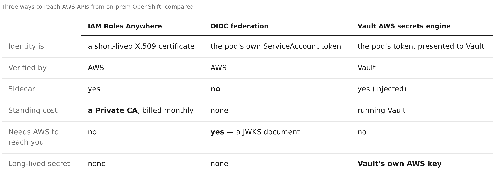

# blog

Long-form write-ups of this project.

| Post | What it covers |
|---|---|
| [Authenticating on-prem OpenShift to AWS: certificates, tokens, or Vault](three-ways-into-aws.md) | The benefits and issues of each of the three methods, how to choose between them, and the failures that cost the most time |

## Publishing to Medium

Medium has no table support — not in the editor, not on paste, and its
import tool drops them. The comparison table is therefore also kept as an
image, rendered from [`../docs/comparison-table.html`](../docs/comparison-table.html):



Regenerate it after editing the HTML:

```bash
python3 - <<'PY'
from playwright.sync_api import sync_playwright
import glob
chrome = sorted(glob.glob("~/.cache/ms-playwright/*/chrome-linux*/chrome"))[-1]
with sync_playwright() as p:
    b = p.chromium.launch(executable_path=chrome, args=["--no-sandbox"])
    pg = b.new_context(viewport={"width": 1400, "height": 800},
                       device_scale_factor=2).new_page()
    pg.goto("file://$PWD/docs/comparison-table.html")
    pg.wait_for_timeout(700)
    pg.locator("#wrap").screenshot(path="docs/images/comparison-table.png")
    b.close()
PY
```

Keep the markdown table in the post as well — it is what renders on GitHub,
and it is the only version a screen reader can use.

## Screenshots

Images live in [`../docs/images/`](../docs/images/) so the blog, the
[README](../README.md) and the
[environment capture](../docs/environment-capture.md) all share one set rather
than keeping duplicates.

They are captured from a live deployment by
[`../docs/capture-environment.sh`](../docs/capture-environment.sh) and the two
console scripts alongside it. **Redaction happens in the page before the
screenshot is taken**, so the images are faithful renders of redacted pages
rather than pictures edited afterwards:

| Redacted | Replaced with |
|---|---|
| AWS account id (plain and `1234-5678-9012` forms) | `111122223333` |
| AWS account alias (identifies the account as well as its id) | `example-account` |
| Access key ids | `ASIAEXAMPLEEXAMPLE00` / `AKIAEXAMPLEEXAMPLE00` |
| IAM unique ids | `AROAEXAMPLEEXAMPLE00` / `AIDAEXAMPLEEXAMPLE00` |
| Secret keys, session tokens, JWTs, Vault tokens | `<redacted>` |
| Certificate serials, SHA-256 fingerprints | `<redacted>` |
| Trust anchor / profile / CA / provider UUIDs | `xxxxxxxx-xxxx-…` |

No console password is ever typed into a page that gets captured: the AWS console
is entered with a short-lived federation token minted from CLI credentials, and
the OpenShift login form is submitted before the first screenshot.
