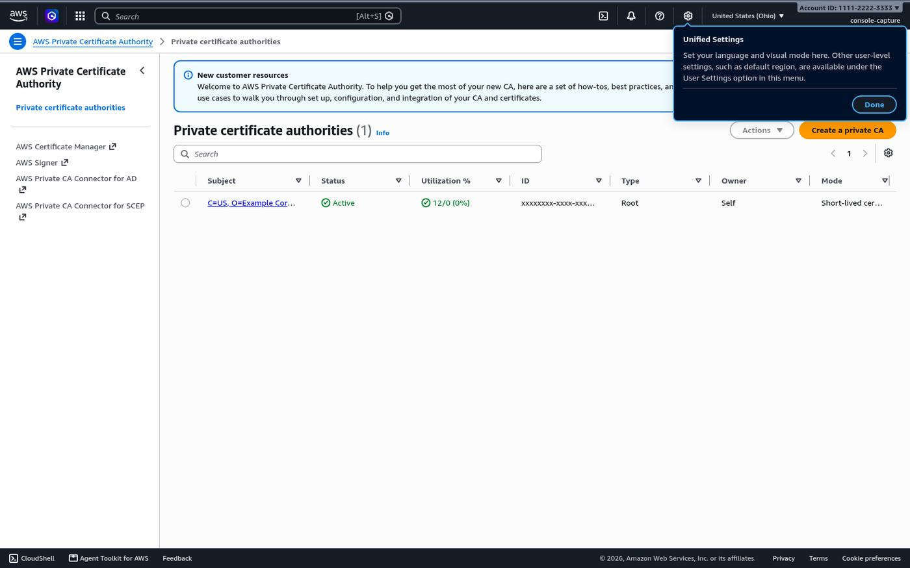
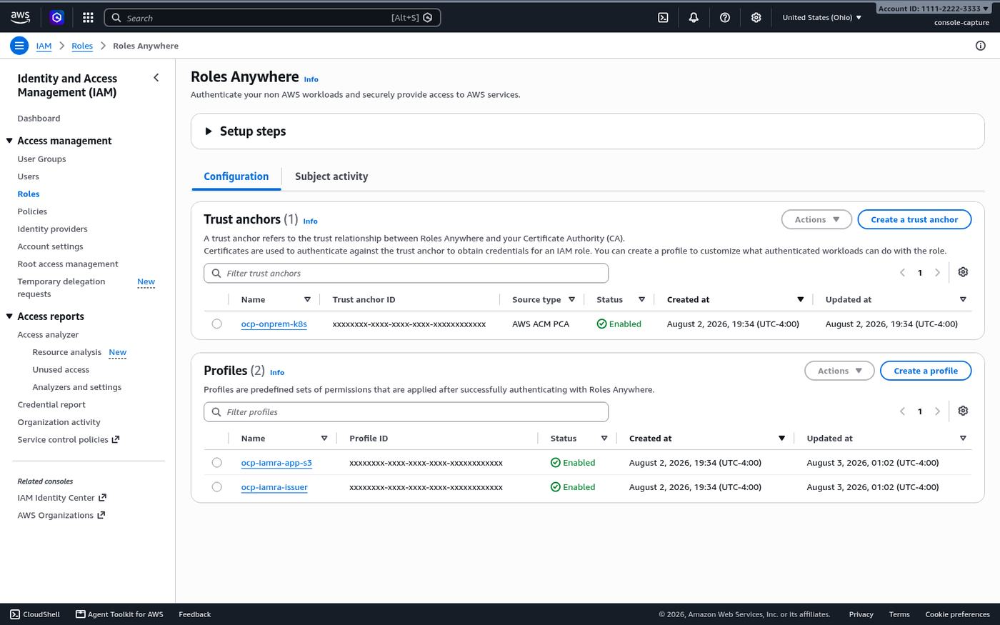
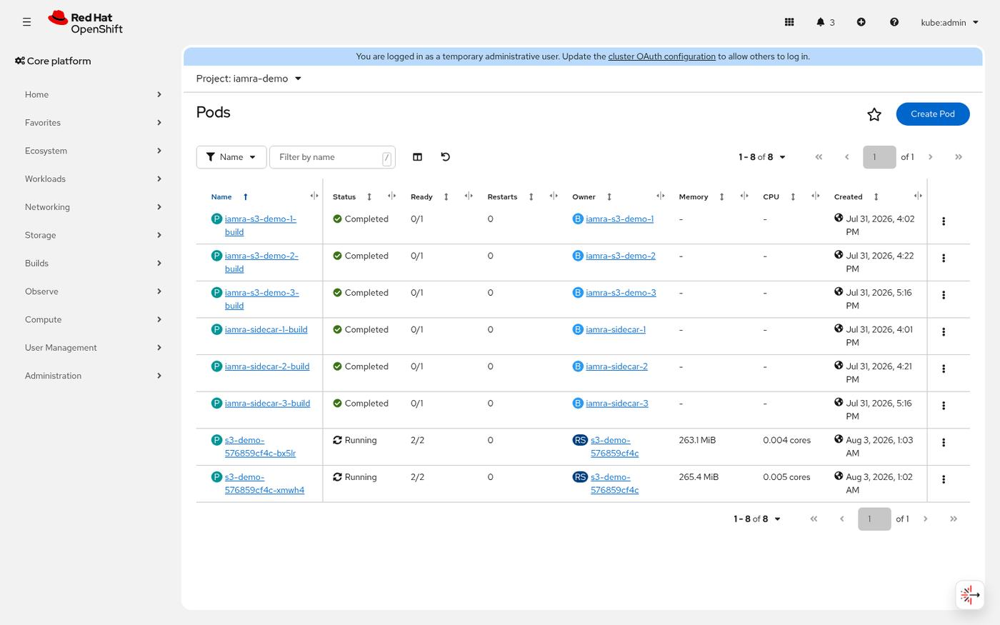
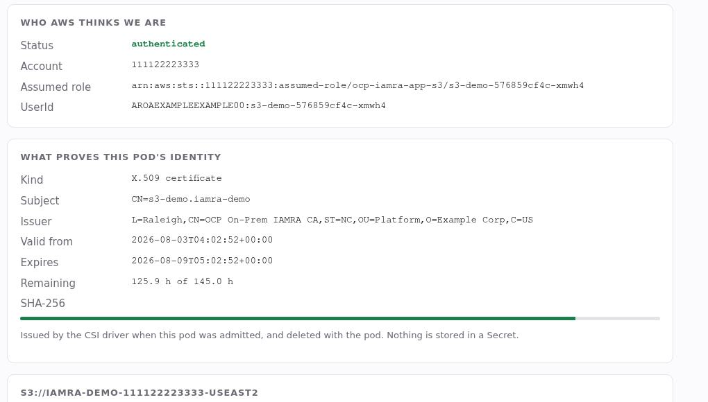
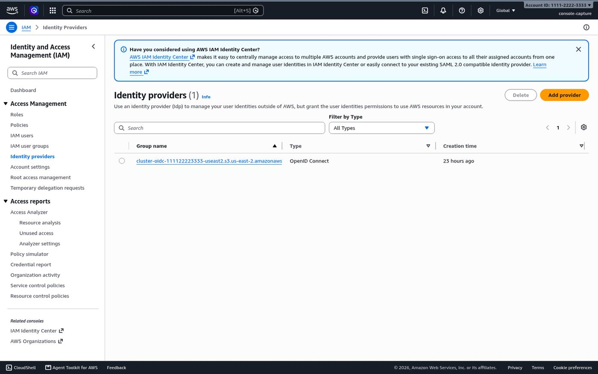
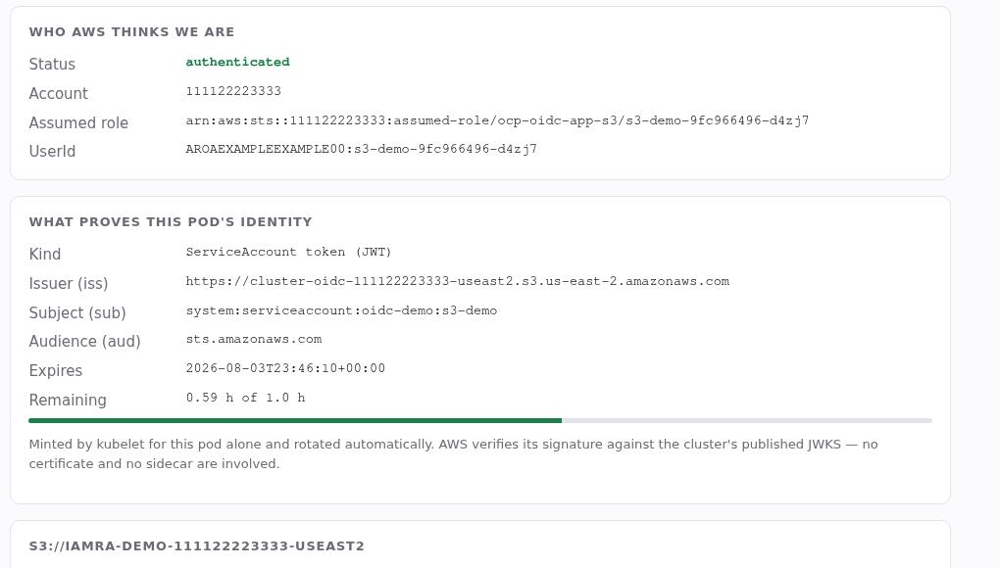
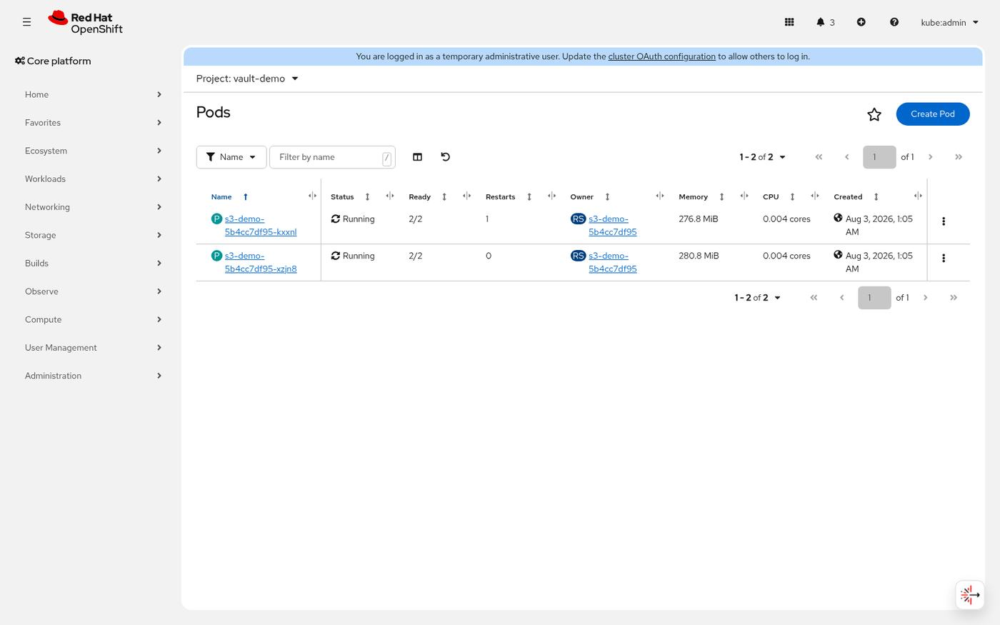
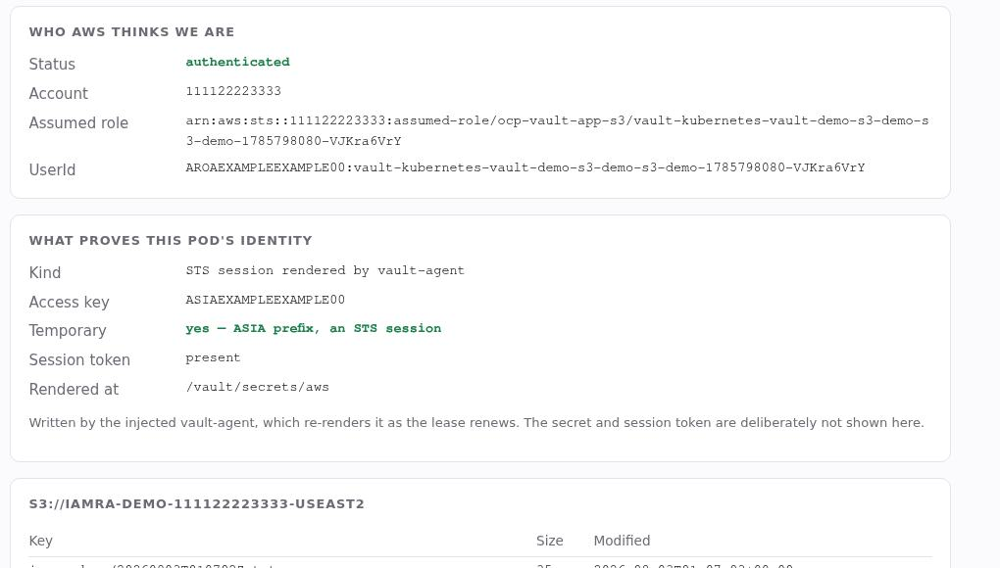
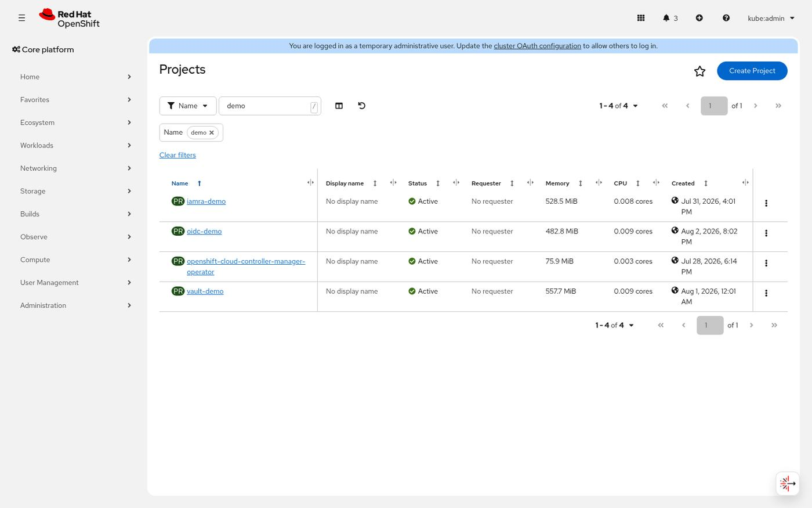

# Authenticating on-prem OpenShift to AWS: certificates, tokens, or Vault

<!--
Meta title:       Authenticating on-prem OpenShift to AWS without a key
Meta description: On-prem OpenShift has no instance profile. Here are three ways to reach AWS APIs without a static access key — certificates, OIDC federation, and Vault.
Slug:             authenticating-on-prem-openshift-to-aws
-->

On EC2, a workload that calls an AWS API does not carry a credential. It asks the
instance metadata service, which hands back short-lived credentials derived from
the instance profile attached to the machine. The identity comes from the
infrastructure, and nobody has to store a key anywhere. A Red Hat OpenShift
cluster running in your own data center has neither of those things — no instance
profile, no metadata service — so the usual answer is an access key in a Secret.
That key does not expire. It does not rotate unless you build something to rotate
it. Anyone with `get secrets` in that namespace has it, and so does anyone holding
a copy of an etcd backup.

There are three ways to replace it, and I built all three on the same cluster so I
could compare them against each other rather than in the abstract: IAM Roles
Anywhere, OpenID Connect (OIDC) federation, and the HashiCorp Vault AWS secrets
engine. The demo
application is byte-identical across all three deployments — ordinary boto3, no
credential handling, no AWS-specific code. Switching mechanisms changes exactly
one environment variable.

## Three ways to prove identity without a key

All three replace the static key with something that expires, and they differ in
who does the verifying. IAM Roles Anywhere presents an X.509 certificate signed by
a certificate authority (CA) that AWS trusts, and the AWS Security Token Service
(STS) trades it for temporary credentials. OIDC federation hands
STS the ServiceAccount token the cluster already issues, which means AWS has to
fetch the cluster's JSON Web Key Set (JWKS). Vault sits in the middle and calls
STS on the pod's behalf.

| | IAM Roles Anywhere | OIDC federation | Vault AWS secrets engine |
|---|---|---|---|
| Identity is | a short-lived X.509 certificate | the pod's own ServiceAccount token | the pod's token, presented to Vault |
| Verified by | AWS | AWS | Vault |
| Sidecar | yes | **no** | yes (injected) |
| Standing cost | **~$400/mo** for a Private CA | none | running Vault |
| Needs AWS to reach you | no | **yes** — a JWKS document | no |
| Long-lived secret | none | none | **Vault's own AWS key** |

Every one of them still needs the cluster to reach AWS outbound. None of this is a
way to use AWS APIs without talking to AWS. What differs is whether AWS also has
to reach *back*.

## IAM Roles Anywhere: the certificate is the identity

cert-manager mints a six-day certificate for each pod, and a sidecar trades it for
STS credentials on a loopback Instance Metadata Service Version 2 (IMDSv2)
endpoint. The application thinks it is on
EC2.

AWS documents this pattern in a [security blog post][aws-post], and that is where
I started. The architecture works as described. Building it on Red Hat OpenShift
surfaced a few things the article does not cover, and those are the parts worth
writing down.

[aws-post]: https://aws.amazon.com/blogs/security/connect-your-on-premises-kubernetes-cluster-to-aws-apis-using-iam-roles-anywhere/

### What you build

AWS Private Certificate Authority (AWS Private CA), in short-lived certificate
mode:



A trust anchor over it, and one Roles Anywhere profile per identity:



Then the cert-manager Operator for Red Hat OpenShift, and an `AWSPCAClusterIssuer`
that mints from that CA. All of it runs from one command:

```bash
./ansible-runner.sh iamra
```

Each pod ends up with two containers: the application, and the credential sidecar.



The application sees a certificate whose common name the IAM trust policy pins:



### The bootstrap problem

`aws-privateca-issuer` needs AWS credentials to issue certificates, and it gets
them by presenting a certificate it cannot have yet. The fix is to issue one
certificate by hand from the CA, put it in a Secret, let the issuer authenticate
with it, and then have cert-manager take ownership of that Secret and renew it
forever.

It is circular and it works, but if the cluster is down long enough for that
certificate to expire, nothing can renew it: you delete the Secret and
re-bootstrap.

### What the walkthrough does not cover

**`aws_signing_helper serve` loads its certificate once, at startup.** When
cert-manager renews it underneath, the process keeps presenting the old one, and
every AWS call fails about a week after deployment. Renewal is not covered, so
this is the first thing you have to add yourself: a liveness probe that fails
while the certificate is still valid but close to expiry, so kubelet restarts the
sidecar and it re-reads the files. The probe has to be `exec`, because the
endpoint binds `127.0.0.1` and kubelet dials the pod IP. The listener refuses every `tcpSocket` probe, so
the sidecar restart-loops while its own log reports that it is serving normally.

**When it fails, it returns HTTP 200.** This one cost me an afternoon. If the
certificate is rejected, the helper does not report an error. It answers the AWS software development kit (SDK)
with:

```json
{"AccessKeyId":"","SecretAccessKey":"","Token":"","Code":"Success",
 "Expiration":"0001-01-01T00:00:00Z"}
```

botocore parses that zero date and raises `OverflowError: date value out of
range`. Nothing in the traceback mentions AWS, credentials, or certificates. An
application that catches only the obvious `ClientError` turns a routine
certificate rejection into an unhandled 500.

**Inline Container Storage Interface (CSI) volumes need
`pod-security.kubernetes.io/enforce: privileged`.** That is the real price of
pod-lifecycle-bound certificates on OpenShift. Security context constraints (SCC)
still govern, so nothing here runs privileged, but the label removes the Pod
Security Admission (PSA) net for the rest of the namespace.

### What it costs, and what it cannot constrain

AWS Private CA bills continuously from creation until deletion — roughly $400 a
month at the time of writing ([AWS Private CA pricing][pca-price]). Disabling it
does not stop the charge, and deleting it enforces a paid restoration window of at
least seven days. The walkthrough does not call out that charge, so plan for it
before you create the CA.

[pca-price]: https://aws.amazon.com/private-ca/pricing/

It also has no condition key for the *subject* of a certificate request, so you
can constrain the template but not the common name. Anyone holding the issuer's
role can mint a certificate with any common name and assume any workload role
under that trust anchor. That is inherent to the design, not a mistake in the
policies. The cluster is where you constrain it: role-based access control (RBAC)
on who can request a certificate, and `approver-policy` to validate the common
name before signing.

## OIDC federation: the cluster's own token

Your cluster already signs identity tokens for every pod. Teach AWS to trust that
signer and the pod can hand its own token to STS directly. Amazon Elastic
Kubernetes Service (EKS) calls this IAM Roles for Service Accounts (IRSA). The
same mechanism works on any cluster that can publish an OIDC discovery document
AWS can fetch, not just EKS.

### What you build

Publish the cluster's OIDC discovery document and JWKS somewhere AWS can fetch
them, register that URL as an identity provider, and point
`spec.serviceAccountIssuer` at it:



Then a role whose trust policy pins the token's `sub` and `aud`:

```json
"Condition": { "StringEquals": {
  "cluster-oidc-….amazonaws.com:sub": "system:serviceaccount:oidc-demo:s3-demo",
  "cluster-oidc-….amazonaws.com:aud": "sts.amazonaws.com"
}}
```

```bash
./ansible-runner.sh oidc
```

The part worth looking at twice:


**One container.** No sidecar, no certificate, no helper process. The AWS SDKs call
`AssumeRoleWithWebIdentity` natively, and the whole integration is two environment
variables and a projected volume.



### How this differs from a bound ServiceAccount token

The two are related but not identical: bound tokens are the *mechanism*, and OIDC
federation is the *trust relationship* that lets an outsider verify one. Every pod
already has a bound token, and that alone gets you nothing with AWS. I mint a
second token deliberately, with its own audience:

| | default token | AWS token |
|---|---|---|
| `aud` | the API server | `sts.amazonaws.com` |
| lifetime | 1 year | 1 hour |

A token lifted from the AWS mount cannot be replayed against the Kubernetes API,
and vice versa. That is what audiences are for.

### What bit me

**The rollout has a split-brain window.** Changing `serviceAccountIssuer` rolls
every kube-apiserver one at a time, and while that happens they disagree. Two pods
of the same ReplicaSet, created in the *same second*, came back with different
`iss` claims: one federated fine, the other was rejected with
`InvalidIdentityToken`. The ClusterOperator's `Progressing` condition flaps
between nodes and reads `False` in the gaps. Check that every control plane node
is at the latest revision before you restart anything that needs AWS access.

**A stale JWKS breaks everything at once.** When the cluster rotates its
ServiceAccount signing keys, the published document no longer contains the key
that signed live tokens, and every workload loses AWS access together.
Republishing is one command, but it has to be a scheduled job.

That is the real trade against Roles Anywhere. A bad certificate takes out one
pod. A stale JWKS takes out the cluster.

## Vault: brokering the credential

The pod proves itself to Vault with its ServiceAccount token, Vault calls
`sts:AssumeRole` on its behalf, and the Vault agent renders the result into a
credentials file.

### What you build

The Kubernetes auth method, a role bound to the demo ServiceAccount, the AWS
secrets engine configured for `assumed_role`, and the agent-injector webhook:

```bash
./ansible-runner.sh vault
```

You write annotations, not container specs. Vault's mutating webhook rewrites the
pod at admission and injects the agent:





### AWS verifies Vault, not the pod

With the other two, AWS verifies the workload: the IAM trust policy names the
certificate common name or the token subject, and you can read it to see which pod
it admits. With Vault, AWS verifies *Vault*. The workload role's trust policy
contains nothing that distinguishes one pod from another; all of that lives inside
Vault, in `bound_service_account_names` and `bound_service_account_namespaces`.
That is not worse, but it changes where you look when something is denied.

### The key you cannot remove

Vault holds a long-lived AWS access key so your pods do not have to. That
concentrates risk in one audited place, which beats a key per namespace, but it is
still the one thing an attacker would go for. Its blast radius is deliberately
tiny: `sts:AssumeRole` on exactly one role, no wildcards. The `iam_user`
credential type needs broad `iam:*` permissions so Vault can create and delete IAM
users. This deployment does not use it. It uses `credential_type=assumed_role`,
which returns an STS session that expires on its own, so Vault never needs those
permissions.

### The Helm flag that cost me an hour

The Vault Helm chart's `global.openshift: true` gives you the
OpenShift-appropriate security contexts you want, and it silently repoints every
image at `registry.connect.redhat.com`, which does not carry the chart's default
tags. Both pods go straight to `ImagePullBackOff` with "name unknown: Image not
found". Keep the flag, and override the image repositories back.

## Choosing between the three

The three coexist on one cluster: the same image in three namespaces, each with
its own IAM role and its own infrastructure.



Running one requires nothing from the other two.

**Start with OIDC if you can publish a JWKS document.** No standing cost, no
sidecar, no certificate machinery, and the SDKs do the work. What it asks in
return is real — AWS must fetch a document you host, and you have to reconfigure
the cluster's token issuer — but it is the simplest of the three to operate once
it is running.

**Use Roles Anywhere when publishing anything AWS-reachable is off the table**, or
when you need the same mechanism for machines outside Kubernetes: it covers
virtual machines and CI runners, and OIDC federation does not. Back the trust
anchor with your own CA and the $400 goes away.

**Use Vault if you already run Vault.** Standing it up for this one problem trades
a credential-distribution problem for an availability problem. If it is already
there, the audit trail and per-workload policy are valuable.

## The seams cost more than the architecture

Almost everything that cost me time was not in the architecture. It was in the
seams. Three of them cost me the most time, and I covered them above. Three more
only bite once you automate the build:

- a probe type that cannot possibly work against a loopback listener
- a helper that returns `200 OK` when it has failed
- a Helm flag that fixes security contexts and breaks image pulls
- an Ansible conditional that is true for the playbook that sets it
- `oc start-build --follow` returning before the Build object is updated
- an SELinux mount flag that makes two concurrent runs impossible

I could not find any of these documented, so they are all written down in the
repo's README, at the point in the code where they bite. If you build one of
these, budget time for the seams.

## Build it yourself

Everything in this post is in
[github.com/MoOyeg/ocp-onprem-aws-auth](https://github.com/MoOyeg/ocp-onprem-aws-auth).
It runs as Ansible inside a container, so the only thing you need installed
locally is Podman — plus a Red Hat OpenShift cluster and an AWS account. Each
method is one command (`./ansible-runner.sh iamra`, `oidc`, or `vault`). If you
hit a seam I missed, open an issue.

*Every screenshot here is from a live deployment. The AWS account id reads
`111122223333` throughout, and key ids, session tokens, certificate serials and
resource UUIDs are fixed placeholders — the redaction runs in the page before the
screenshot is taken.*
