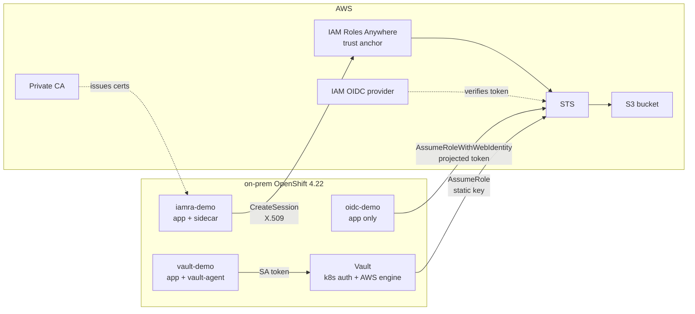
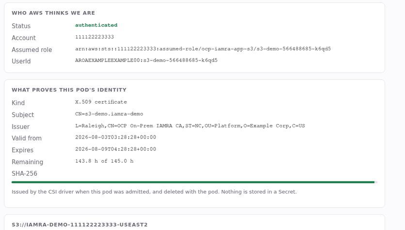
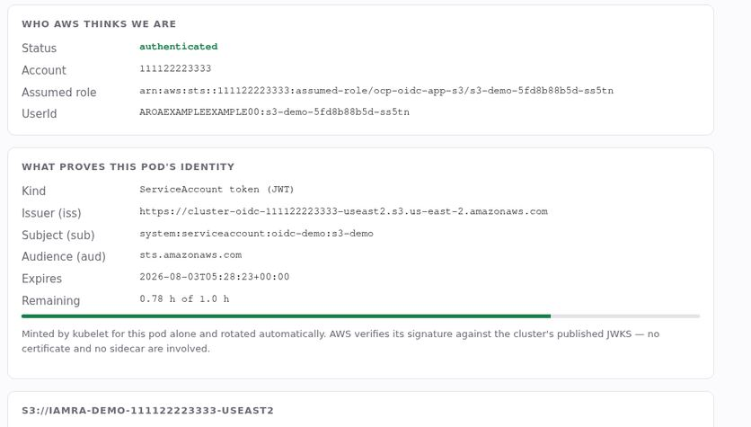
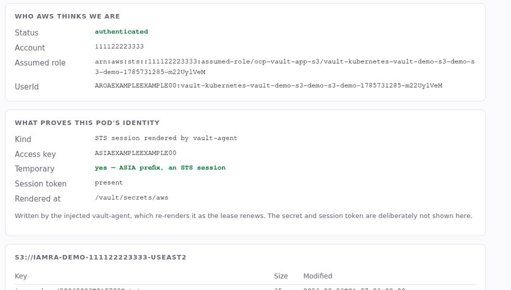

# Environment capture — three AWS auth paths, side by side

A capture of the running environment: one OpenShift cluster, one unmodified
application image, three different ways of proving identity to AWS — all live at
the time of capture. Everything below is real output, not reconstructed.

Regenerate with [`capture-environment.sh`](capture-environment.sh).

| | |
|---|---|
| Cluster | cluster2 · OpenShift 4.22.0 |
| Region | us-east-2 |
| Captured | 2026-08-03 04:45 UTC |

> **Redacted.** The AWS account id is replaced throughout with the
> documentation-reserved `111122223333`. Access-key ids, secret keys, session
> tokens, JWTs, certificate serials and resource UUIDs are replaced with fixed
> placeholders. Structure is preserved — an ARN still looks like an ARN — so
> nothing below discloses account-identifying or secret material. The redaction
> pass is [`redact.py`](redact.py).

---

## At a glance

| | `iamra` | `oidc` | `vault` |
|---|---|---|---|
| Namespace | `iamra-demo` | `oidc-demo` | `vault-demo` |
| Proves identity | X.509 certificate | projected ServiceAccount token | ServiceAccount token, to Vault |
| Verified by | AWS | AWS | **Vault** |
| Containers | 2 — app + `iamra-sidecar` | **1 — app only** | 2 — app + `vault-agent` |
| Assumes | `ocp-iamra-app-s3` | `ocp-oidc-app-s3` | `ocp-vault-app-s3` |
| Status | 2/2 running, verified | 2/2 running, verified | 2/2 running, verified |

- **`iamra`** — a sidecar exchanges a 6-day certificate for STS credentials and
  serves them on a loopback IMDSv2 endpoint.
- **`oidc`** — the AWS SDK federates natively with the pod's own token. Nothing
  else is in the pod.
- **`vault`** — Vault holds the AWS credential and assumes the role on the pod's
  behalf; its agent renders the result to a file.

## How each path reaches AWS



The three routes converge on STS and then on the same S3 bucket. Note where
verification happens: AWS checks the workload directly for the first two, and
checks Vault for the third.

## The same application, three identities

Each pod runs a byte-identical image. The page renders whatever that pod happens
to be using, which is the only thing that differs.

### iamra



The certificate is minted by the CSI driver at pod admission and dies with the
pod. `CN=s3-demo.iamra-demo` is the exact string the IAM trust policy pins.

### oidc



No certificate and no sidecar. The token's `iss`, `sub` and `aud` are all
conditions AWS evaluates before issuing credentials.

### vault



AWS never sees the pod. The `ASIA` prefix confirms Vault handed back a temporary
STS session rather than creating an IAM user.

## Cluster state

```console
$ oc get pods -A -l app=s3-demo
### PODS ###
iamra-demo   s3-demo-566488685-cg6d2    true        app
iamra-demo   s3-demo-566488685-k6qd5    true        app
oidc-demo    s3-demo-5fd8b88b5d-6qb2f   true        app
oidc-demo    s3-demo-5fd8b88b5d-ss5tn   true        app
vault-demo   s3-demo-58d7c4bd5f-2928w   true,true   app,vault-agent
vault-demo   s3-demo-58d7c4bd5f-q2xrc   true,true   app,vault-agent

### NAMESPACE PSA ###
iamra-demo   enforce=privileged
oidc-demo    enforce=
vault-demo   enforce=

### CLUSTER ###
OpenShift 4.22.0
serviceAccountIssuer https://cluster-oidc-111122223333-useast2.s3.us-east-2.amazonaws.com
```

Container counts are the giveaway: `oidc-demo` runs one container, the other two
run a credential sidecar alongside the app. Only `iamra-demo` needs the
`privileged` Pod Security Admission label, because only it mounts an inline CSI
volume.

## What each pod actually presents

Run inside the pod with `token-info`, which decodes the identity material for
whichever method is configured and prints the default Kubernetes token beside it
for comparison.

### iamra — a short-lived certificate

```console
$ oc -n iamra-demo exec deploy/s3-demo -c app -- token-info
auth method     iamra
pod             s3-demo-566488685-cg6d2
serviceaccount  s3-demo in iamra-demo

AWS environment
  AWS_EC2_METADATA_SERVICE_ENDPOINT=http://127.0.0.1:9911/
  AWS_REGION=us-east-2

--- X.509 certificate ---
  path                 /iamra/tls.crt
  subject              CN=s3-demo.iamra-demo
  issuer               L=Raleigh,CN=OCP On-Prem IAMRA CA,ST=NC,OU=Platform,O=Example Corp,C=US
  serial               <hex-redacted>
  not_before           2026-08-03T03:28:05+00:00
  expires              2026-08-09T04:28:04+00:00
  remaining_seconds    517481
  sha256               <hex-redacted>

--- default token for the Kubernetes API ---
  path                 /var/run/secrets/kubernetes.io/serviceaccount/token
  alg                  RS256
  kid                  SzvQSFKZlYgkEEkqeSiycVD68f6x9h2-fzvL_O693Dc
  issuer               https://cluster-oidc-111122223333-useast2.s3.us-east-2.amazonaws.com
  subject              system:serviceaccount:iamra-demo:s3-demo
  audience             ['https://cluster-oidc-111122223333-useast2.s3.us-east-2.amazonaws.com', 'https://kubernetes.default.svc']
  bound_to             {'name': 's3-demo-566488685-cg6d2', 'uid': 'xxxxxxxx-xxxx-xxxx-xxxx-xxxxxxxxxxxx'}
  expires              2027-08-03T04:28:04+00:00
  lifetime_seconds     31536000
```

Six days of validity, renewed by cert-manager at 24 hours remaining.

### oidc — two tokens, different audiences

```console
$ oc -n oidc-demo exec deploy/s3-demo -c app -- token-info
auth method     oidc
pod             s3-demo-5fd8b88b5d-6qb2f
serviceaccount  s3-demo in oidc-demo

AWS environment
  AWS_REGION=us-east-2
  AWS_ROLE_ARN=arn:aws:iam::111122223333:role/ocp-oidc-app-s3
  AWS_ROLE_SESSION_NAME=s3-demo-5fd8b88b5d-6qb2f
  AWS_WEB_IDENTITY_TOKEN_FILE=/var/run/secrets/aws/token

--- projected token for AWS ---
  path                 /var/run/secrets/aws/token
  alg                  RS256
  kid                  SzvQSFKZlYgkEEkqeSiycVD68f6x9h2-fzvL_O693Dc
  issuer               https://cluster-oidc-111122223333-useast2.s3.us-east-2.amazonaws.com
  subject              system:serviceaccount:oidc-demo:s3-demo
  audience             ['sts.amazonaws.com']
  bound_to             {'name': 's3-demo-5fd8b88b5d-6qb2f', 'uid': 'xxxxxxxx-xxxx-xxxx-xxxx-xxxxxxxxxxxx'}
  expires              2026-08-03T05:28:04+00:00
  lifetime_seconds     3600

--- default token for the Kubernetes API ---
  audience             ['https://cluster-oidc-111122223333-useast2.s3.us-east-2.amazonaws.com', 'https://kubernetes.default.svc']
  lifetime_seconds     31536000
```

Same subject, same signing key — but the AWS one is scoped to
`sts.amazonaws.com` and lives one hour, while the default Kubernetes token is
audienced to the API server and lives a year. Sending the wrong one gets it
rejected.

### vault — an ordinary credentials file

```console
$ oc -n vault-demo exec deploy/s3-demo -c app -- token-info
auth method     vault
pod             s3-demo-58d7c4bd5f-2928w
serviceaccount  s3-demo in vault-demo

AWS environment
  AWS_REGION=us-east-2
  AWS_SHARED_CREDENTIALS_FILE=/vault/secrets/aws

--- vault-rendered credentials ---
  path                 /vault/secrets/aws
  access_key_id        ASIAEXAMPLEEXAMPLE00
  temporary            True
  secret_access_key    <redacted>
  session_token        <redacted>
```

Written to tmpfs by the injected `vault-agent`. The `ASIA` prefix marks it as a
temporary STS session rather than a permanent IAM user key.

## Inside the IAM Roles Anywhere sidecar

The credential endpoint binds `127.0.0.1`, so it can only be inspected from
within the sidecar. `imds-probe` performs the same IMDSv2 exchange an AWS SDK
would.

```console
$ oc -n iamra-demo exec deploy/s3-demo -c iamra-sidecar -- imds-probe
=== certificate being presented ===
  subject=CN=s3-demo.iamra-demo
  issuer=C=US, O=Example Corp, OU=Platform, ST=NC, CN=OCP On-Prem IAMRA CA, L=Raleigh
  notBefore=Aug  3 03:28:05 2026 GMT
  notAfter=Aug  9 04:28:04 2026 GMT
  serial=<hex-redacted>
  status=valid

=== configured identity ===
  ROLE_ARN=arn:aws:iam::111122223333:role/ocp-iamra-app-s3
  PROFILE_ARN=arn:aws:rolesanywhere:us-east-2:111122223333:profile/xxxxxxxx-xxxx-xxxx-xxxx-xxxxxxxxxxxx
  TRUST_ANCHOR_ARN=arn:aws:rolesanywhere:us-east-2:111122223333:trust-anchor/xxxxxxxx-xxxx-xxxx-xxxx-xxxxxxxxxxxx
  AWS_REGION=us-east-2
  ROLE_SESSION_NAME=s3-demo-566488685-cg6d2
  RELOAD_BEFORE=43200

=== IMDSv2 exchange on http://127.0.0.1:9911 ===
  PUT /latest/api/token                       ok
  GET .../security-credentials/               ocp-iamra-app-s3

=== credentials ===
  AccessKeyId       ASIAEXAMPLEEXAMPLE00
  SecretAccessKey   <redacted, use --raw>
  Token             <redacted, use --raw>
  Expiration        2026-08-03T05:28:09Z
  Code              Success
```

The probe checks the credential *fields* rather than the HTTP status, because a
failed certificate exchange still returns 200 with `Code: Success` and empty
keys.

## What exists in the AWS account

```console
### IAM ROLES ###
  ocp-iamra-app-s3
  ocp-iamra-issuer
  ocp-oidc-app-s3
  ocp-vault-app-s3
### ROLES ANYWHERE ###
  trust anchor: ocp-onprem-k8s
  profiles:     ocp-iamra-app-s3   ocp-iamra-issuer
### PRIVATE CA ###
  ACTIVE   SHORT_LIVED_CERTIFICATE
### OIDC PROVIDER ###
  arn:aws:iam::111122223333:oidc-provider/cluster-oidc-111122223333-useast2.s3.us-east-2.amazonaws.com
```

One role per method, plus the issuer's own. Roles Anywhere profiles and the
Private CA belong to the `iamra` path only; the OIDC provider serves the `oidc`
path; the `vault` path needs neither, just an IAM user Vault authenticates as.

## What each choice costs

| | `iamra` | `oidc` | `vault` |
|---|---|---|---|
| Proves identity | X.509 certificate | projected SA token | SA token, to Vault |
| Verified by | AWS | AWS | Vault |
| Sidecar | yes | **no** | yes (injected) |
| Recurring AWS cost | **~$400/mo** Private CA | none | none |
| Outbound to | `rolesanywhere`, `acm-pca` | `sts` | `sts`, from Vault only |
| Inbound needed | none | **JWKS AWS can fetch** | none |
| Long-lived secret | none | none | **Vault's AWS key** |
| Cluster reconfiguration | none | **kube-apiserver rollout** | none |
| PSA relaxation | **privileged** | none | none |
| Failure blast radius | one workload | **whole cluster** | Vault outage |
| Non-Kubernetes hosts | **yes** | no | yes |

---

Vault runs in dev mode (in-memory, unsealed) because the cluster has no storage
class — suitable for demonstration only. The Private CA in this account bills
continuously until deleted.
